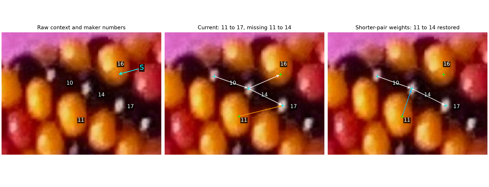
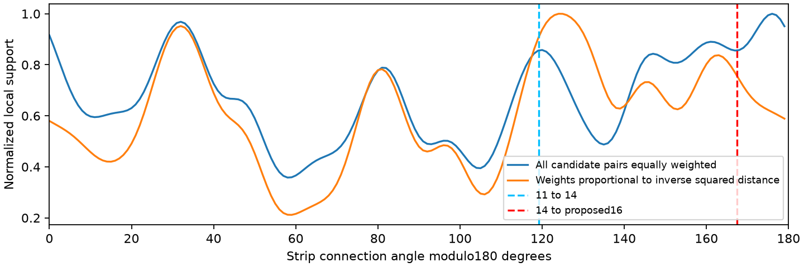

# Why the 11→14 d3 link is missing — R171

Both bodies have image-derived detections with established ownership: the point
on11 is inside its maker-confirmed interior, and the reflection on14 is inside
its confirmed interior. The current graph misses their supplied d3 relationship
at the angle gate. Shorter-pair direction estimates recover it, but lose other
correct links. No experimental variant is adopted into the automatic labeler.

**R173 maker clarification:**11→14→16 is correct, but the selected point on14
is not close to the center of its visible part; black beads are hard to see.
[Exact statement and point provenance](anchor-position-note-r173.json) are saved.
The48.32° result measures connections between these selected points, not a bend
between bead centers. Body ownership remains confirmed while geometric position
is uncertain. No replacement point or numerical offset was supplied.

## Q171.1 — Ownership of point S on the proposed bead16

In the **raw left panel**, does cyan **S** lie inside the same yellow bead as
the maker's existing number **16**? S marks the automatic interior point, not the
maker's location. This checks body ownership only; it does not ask for a physical
center or outward point. The ownership of the points on11,14 and17 is already
supported by confirmed interiors and is not being asked again.



**R172 answer:** “Yes, S is inside bead 16.” Preserve the exact reply, stable IDs
and image hash in [neighbor-confirmed-r172.json](neighbor-confirmed-r172.json).
Together with the confirmed interiors on11 and14, this establishes all three
body identities in the supplied11→14→16 d3 chain. The selected points remain
noncollinear. The frozen experiment records S's provisional status at measurement
time; numerical outputs do not change with the answer.

Raw crop [1225,235,1355,335] in EXIF-oriented source pixels, x right/y down.
S=(1319.29349,269.52565). The cyan arrow in the left panel ends on S; green plus
marks in the other panels are chromatic-interior points and cyan plus marks are
reflection points. Arrows connect these selected points; none traces boundaries.
The orange current11→17 d3 proposal disagrees with the supplied bead relations.
The experimental blue11→14 d3 arrow is restored, while14→16 d3 is lost.
White arrows show selected other current relations for context, not confirmation
of all unit offsets or adjacency.

## Four methods and this bounded test

| Method | Use here |
| --- | --- |
| Learn directions from shorter candidate connections | Test whether long connections pull the local angular peak away from a nearest-neighbor family; selected for this diagnostic |
| Rank primarily by distance | Possible alternative; the nearest point can belong to the same body or another direction, so proximity alone is insufficient |
| Test small lattice triangles and competing neighbors | Next candidate: retain topology alternatives across noncollinear interior points; two existing wrong edges can support a wrong triangle |
| Fit projected bead geometry and exposed outward anchors | More expensive fallback; current interior/reflection marks are not such anchors |

Replay the pinned R169 detector from commit f42b488 on appearance pixels before
reading maker coordinates or rendered ID pixels. For each input, finish all seven
graph variants before evaluating them. Keep detection, candidate pairs, local
window, smoothing, angular gate, selection score, reciprocity and gap rules
unchanged. Only histogram weights change: uniform baseline; inverse distance to
powers1,2,4; or uniform weights restricted to distances≤1.25,1.5,1.75 times
the image-derived median nearest spacing. These are diagnostic comparisons,
not a learned choice from the maker's labels.

## Exact rejection and the ambiguity in the direction estimate

| Supplied or proposed pair | Along-strip delta | Across-strip delta | Angle modulo180° | Point distance, analysis pixels |
| --- | ---: | ---: | ---: | ---: |
| Supplied11→14 d3 | +6.00 | −10.77 | 119.12° | 12.07 |
| Supplied14→proposed16 d3 | +15.00 | −3.34 | 167.44° | 14.24 |
| Current11→17 d3 proposal | +19.00 | −1.44 | 175.68° | 18.42 |

The11→14 pair is inside the candidate radius and is the closest other point
to11. Its pair-averaged local modes are d1=81°,d2=32.5°,d3=161°. Deviations
are38.12°,86.62°,41.88°. The program picks the closest family d1, then rejects
it because even that deviation exceeds22°. It never reaches mutual-neighbor
or gap selection. The161° peak is not a confident identification of d3.



This window has several angular peaks. Inverse-squared distance weighting shifts
the pair's d3 estimate to124.5°, admitting11→14. It also removes the currently
reproduced14→16 relation. The two measured connections differ by48.32°; one
shared direction angle with a22° gate cannot fit both. Their points can be
inside the correct bodies without being consistent physical centers or outward
minor-circle anchors. This is a limitation of the point/direction representation;
it does not measure camera elevation or prove a geometric cause. R172 confirms
S belongs to16, so this discrepancy is not an ownership error at S.
R173 specifically identifies14's reflection point as displaced from its visible-
area center. This is a plausible contributor to the measured angular discrepancy;
its contribution has not been quantified. The visible-area center, physical
center and outward minor-circle anchor are three different position concepts.
Keep the reflection as an observation anchor, with separate positional uncertainty
when assessing adjacency; the confirmed interior loop is not a full bead outline.

## Paired photo and independent render checks

Use the unchanged maker snapshot revision422,76points/41series/129completed
links; SHA1a99b514b07707176b18ec5f9d2790ddbdb33e060dbcfd9884599f49b17137ff.
All variants share the same958 points and the same63 nearby maker associations.
Proximity associations are not proof of all body identities.

| Variant | Photo proposed links | Forward-agree maker links /129 | 11→14 restored | 14→proposed16 retained |
| --- | ---: | ---: | --- | --- |
| Baseline | 1462 | 49 | No | Yes |
| Inverse distance | 1441 | 50 | No | No |
| Inverse squared distance | 1385 | 54 | Yes | No |
| Inverse fourth-power distance | 1302 | 48 | Yes | No |
| Distance≤1.25×spacing | 1358 | 56 | No | Yes |
| Distance≤1.5×spacing | 1415 | 52 | Yes | No |
| Distance≤1.75×spacing | 1468 | 54 | No | Yes |

The changed estimates trade individual links rather than giving a stable repair.
For the three variants that recover11→14, independent known-source render
checks also lose true unsigned1/6/7 neighbors:

| Known fixture | Baseline true / proposed | Inverse squared | Inverse fourth-power | Distance≤1.5×spacing |
| --- | ---: | ---: | ---: | ---: |
| Hand +1, blue/amber/black | 280/292 | 270/285 | 242/262 | 278/292 |
| Hand −1, same appearance | 271/279 | 268/278 | 254/271 | 269/277 |
| Hand +1, changed palette/background/placement | 279/291 | 276/288 | 250/272 | 276/289 |

Detection is unchanged: eligible-body counts132/168,133/168,133/169; zero
points on paper and4/4/3 duplicate points. ID pixels are evaluator-only; render
unsigned-neighbor scores do not certify direction names/signs or photo helicity.
No angle-weight variant recovers the target without these measured losses.
The production program, current proposals and maker live save remain unchanged.

## Reproduce and stopping point

```sh
.venv/bin/python photo2/probe_neighbor_angles.py
```

Existing R167 appearance/ID fixtures are reused read-only. On a fresh checkout,
create them first with `photo2/check_auto_labels.py --output photo2/output/r167/calibration`,
and reproduce the separate R169 proposal file as described in
[REFLECTION_SUPPRESSION.md](REFLECTION_SUPPRESSION.md). The probe asserts that
the baseline positions, maker evaluation and render counts match the frozen R169
results. [Summary](review/r171/summary.json) preserves source/script/fixture/
image hashes, exact pair measurements and every variant's results.

**Stopping point:** diagnose one missed adjacency and reject a simple angular
reweighting fix with controlled counterexamples. **Next bounded task:** preserve
competing neighbors and test small triangle consistency using supported body
identities, representing reflection-point displacement as positional uncertainty
instead of treating each point as a precise representative location. Do not infer
full-string indices,N,closure,repeat or helicity from this experiment.
Recommend **gpt-6.1-sol / High**, same conversation; no `/new` needed.
