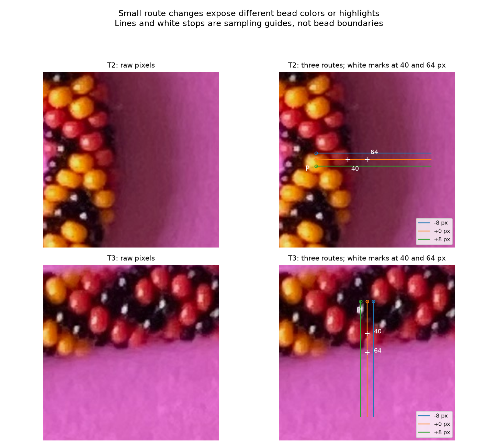
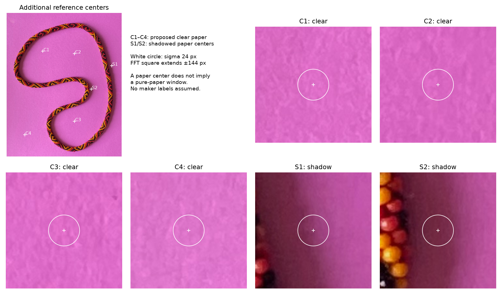

# Does the clue survive a small sideways move? — R104

**The local hue trend survives, but the strongest hue change is not a dependable
bead-edge marker.** Texture crossings are fairly stable to an eight-pixel path
shift at a fixed setting, yet change substantially when the paper reference or
window size changes. No contour points are selected by this experiment.

## What moves, and what stays fixed

T1/T2/T3 from R099 are each translated −8, 0 and +8 pixels perpendicular to their
sampling direction. T1/T2 move vertically; T3 moves horizontally (+8 means left).
The original endpoint reasons remain in R099. Moved starts are **not automatically
confirmed bead interiors**: they can land on a different color, seam or highlight.
Both endpoints translate together; distance is measured from each shifted P.



White stops at 40/64 pixels connect the image to the numerical comparison below.
They are inherited comparison locations, not inferred edges. The close-ups show
only the first 144 pixels of the routes; measurements continue to Q at 192 pixels.

Full views separate raw context, endpoints, routes, sampled colors and measurements:
[T1](review/r104/T1-parallel.png), [T2](review/r104/T2-parallel.png),
[T3](review/r104/T3-parallel.png). All are diagnostics on the original JPEG.
No old HSV range, source pattern, scene geometry or bead index enters the scores.

## Hue: a persistent trend, several competing causes

Measure the circular hue change from pixel 40 to pixel 64, without a red/magenta
threshold. Negative angles here follow the direction toward magenta, but the
calculation itself works with any hue origin.

| Path | −8 offset | Original route | +8 offset |
| --- | ---: | ---: | ---: |
| T1 | −9.7° | −13.1° | −8.8° |
| T2 | −12.3° | −12.6° | −12.2° |
| T3 | −32.8° | −28.0° | −26.9° |

The T1/T2 direction persists on all shifted routes. That supports the maker's
suggestion to retain hue as a local clue despite overlapping HSV ranges.
It does not establish that either end of this interval is on a particular surface.

The plots also compare **eight pixels before** each sample to **eight pixels
after**, excluding the center. Average hue on a circle, weighted by RGB chroma,
then take the signed angular difference. Neutral or cancelling neighborhoods
return undefined values; hue is not assigned to them by convention. This local
cue uses no color labels. Its largest absolute response, however, moves:

| Path | Largest response location, −8 / 0 / +8 offsets |
| --- | --- |
| T1 | 21 / 18 / 21 px from P |
| T2 | 43 / 16 / 16 px |
| T3 | 58 / 56 / 16 px; +8 also reverses the response sign |

In the T2 raw crop/color strips, the original and +8 paths begin on yellow then
cross red, while the −8 path begins in a darker/redder area. T3's +8 path passes
through a bright, pale region early. These visible changes explain why a large
hue response need not be the outer silhouette. These are assistant interpretations
of the crops, not new maker labels or proofs of the physical cause at each pixel.

## Texture: path movement versus reference choice

Reuse the R099 detrended FFT power above 1/64 cycles/pixel and spatial sigma-4
blur residual. Gaussian window sigmas are 24, 12 and 6; FFT squares remain
289×289 with no image-edge padding. Crossing rule is unchanged: start above
threshold, finish below, report the last above-to-below interval midpoint.

At **sigma 12 and twice the original paper reference**, changing only the route
gives the following crossings (−8 / 0 / +8 offsets):

| Path | FFT crossing | Spatial crossing |
| --- | --- | --- |
| T1 | 42 / 42 / 42 px | 30 / 34 / 34 px |
| T2 | 46 / 46 / 46 px | 34 / 34 / 34 px |
| T3 | 66 / 70 / 74 px | 58 / 62 / 66 px |

Those stable T1/T2 numbers still disagree between methods. Stability is not edge
accuracy. T3 at sigma 6 and a 3× original reference retains the nominal failure
and adds a −8-route failure: both start below the spatial-texture threshold.
They remain unresolved, rather than being converted to a boundary at P.

### Paper controls and an adaptive follow-up



C1–C4 are four visually chosen clear-paper locations; S1/S2 are old shadowed-paper
centers R092 E/F. Labels are provisional. The white ring is sigma 24, not the
full support. A center on paper does not establish a pure-paper window: S2 has
nearby beads in the surrounding context. None of these is a final runtime seed.

First add the clear samples, then the shadow samples, to the original 18 overlapping
reference centers. **Neither addition changes any maximum or threshold.** The old
maxima dominate. That alone would be a weak reference-sensitivity test, so we
explicitly extended it to use only the four new clear samples or only S1/S2.
The initial additive result remains recorded; no alternative was selected as best.

Replacing the reference by the new-clear-only maximum moves comparable crossings
**0–24 pixels farther toward Q**. Using shadow-only references moves them **4–32
pixels**. Each comparison has 106 matched settings; two originally unresolved
settings are excluded from the shift calculation and remain recorded separately.
The lower replacement thresholds produce crossings for those two failures, but
this does not establish a correction: the reference scale itself changed.

| Path | Original reference: crossing range | New clear only | Shadow only |
| --- | --- | --- | --- |
| T1 | 10–54 px | 22–58 px | 30–62 px |
| T2 | 2–58 px | 26–62 px | 34–70 px |
| T3 | 42–86 px, two unresolved | 50–90 px | 54–94 px |

Each range spans three offsets, three window scales, two cues and threshold
multiples 2/3. It describes algorithm disagreement, not a confidence interval.
Do not compare it as an accuracy score against R099's differently sized sweep.

## What this establishes and the next useful step

Keep local hue information, but reject a largest-hue-change-only edge rule.
Do not declare reference robustness from adding samples when the old maximum
always dominates. Neither global hue boxes nor these manually chosen paper
regions should become final inference assumptions. The hue-difference control
is invariant to a global shift of hue zero; that mathematical check is **not**
a demonstration that the complete pipeline handles arbitrary palettes or lighting.

R105 changes the next step: **search farther along the necklace for reliable
boundary evidence, then bridge ambiguous spans with a smooth large-scale
envelope**. Preserve the smaller scallops caused by individual beads as a
separate geometric scale. A smooth prediction is not itself measured evidence.
The initially proposed whole-image texture search is deferred.

Three implementation options for that follow-up:

1. **Local cubic bridge:** interpolate between supported boundary neighborhoods,
   using their tangents where those are reliable. Easy to inspect; weak tangent
   estimates or long gaps can cause overshoot.
2. **Robust smoothing spline:** fit several supported neighborhoods with weights
   for evidence quality and a curvature penalty. Can reject isolated bad points;
   smoothing strength must be varied so genuine bends are not erased.
3. **Coupled inner/outer envelopes:** use both sides and a slowly varying width
   to constrain weak spans. Adds useful context but may bias width or sharp bends;
   treat as a later alternative if a local bridge is insufficient.

Start with a small wider-context anchor review and the simplest supported bridge,
showing raw evidence separately from predictions and varying anchor choices.
Stop before adopting a whole-necklace contour, centerline or bead fit. Candidate
anchors must have local evidence beyond smoothness; agreement between correlated
filters alone cannot verify them. Leave spans unresolved if evidence is absent.
Fixed diagnostic crops stay outside eventual runtime priors under R103. Existing
visual questions remain optional; no exact boundary labels are inferred from R105.

## Reproduce and verify

```bash
.venv/bin/python photo2/parallel_paths.py --output photo2/output/r104
```

[Diagnostic configuration](parallel-paths-r104.json), [script](parallel_paths.py),
[report and hashes](review/r104/report.json). Python 3.12.14 and existing local
dependencies. 1,323 texture measurements, 1,737 hue samples, 18 new paper/scale
measurements and 540 crossing cases. Five figures and report are curated; CSVs
remain in ignored output and are recreated by the command.

Checks: circular wrap, hue-origin invariance, constant hue and undefined neutral
controls pass. Nominal texture results match R099; independent hue-difference
and crossing recomputations pass; repeat artifacts match byte-for-byte. Source,
configuration, helpers and output hashes checked; all five images inspected.
No numerical failures or endpoint edits; shifted points remain provisional.
No renders, prior-pipeline reruns or changes to the source photo or earlier artifacts.

For feedback, use the [two existing questions with the new comparisons](TRANSITION_QUESTIONS.md).
