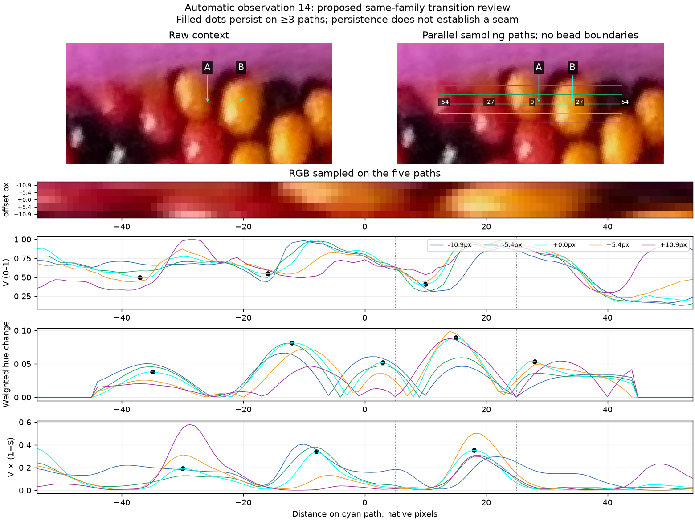
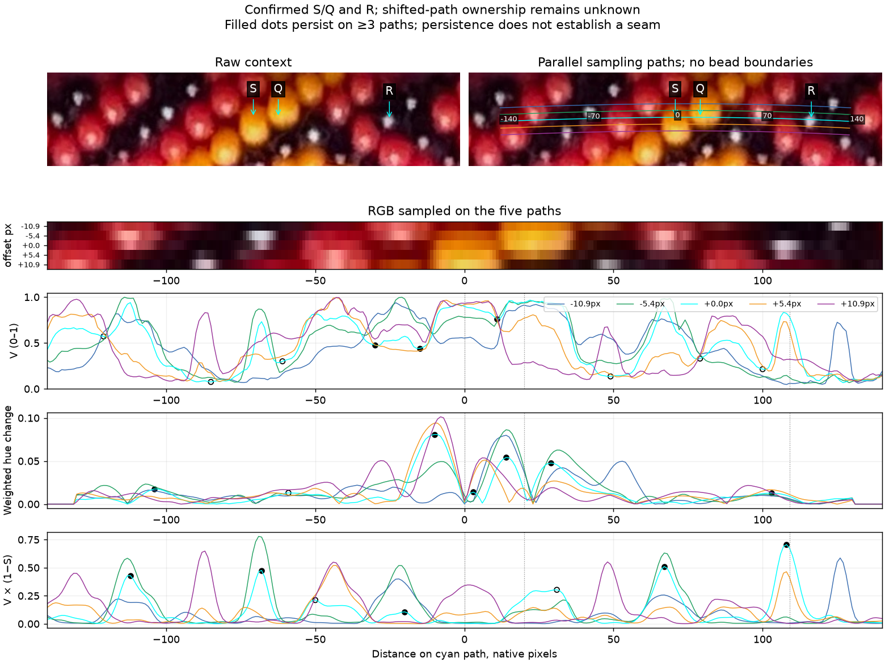
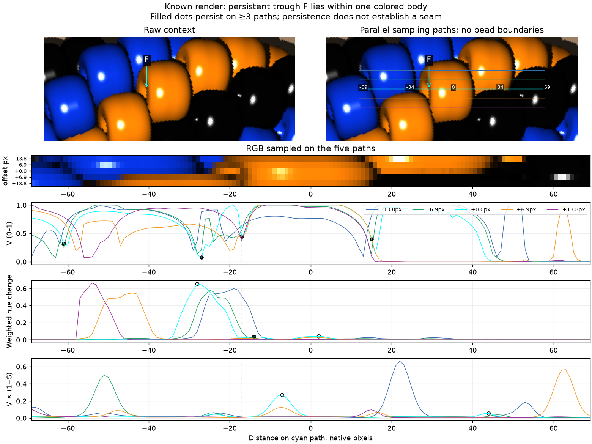
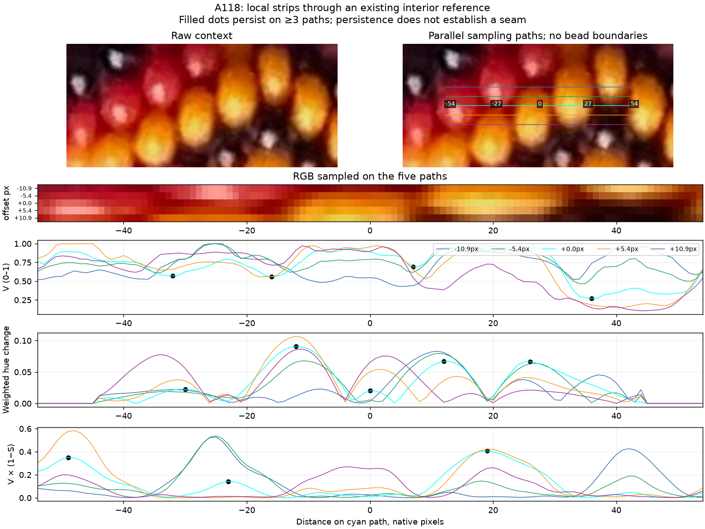
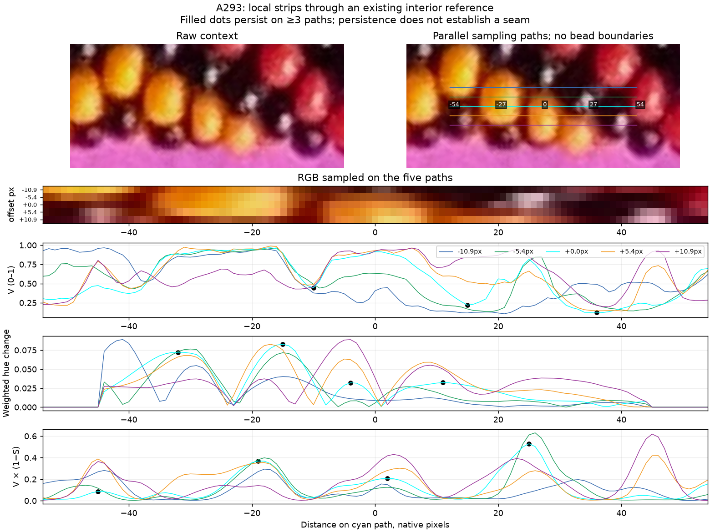
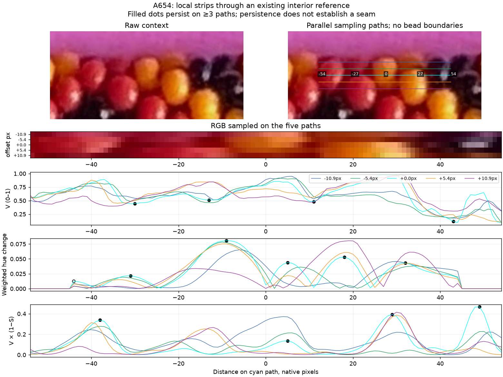
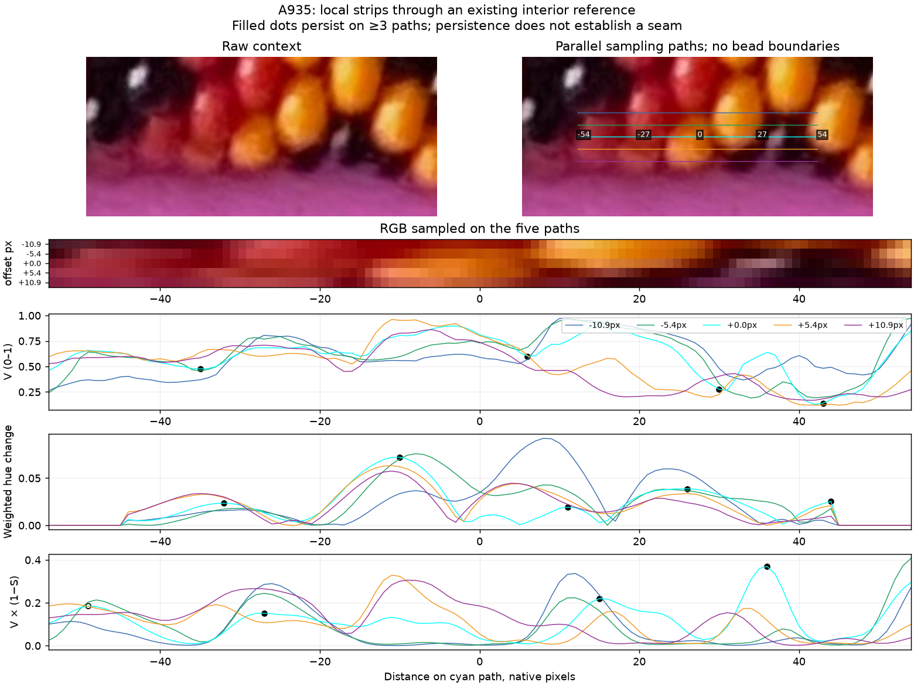

# Parallel-path bead cues — R208–R209

The one-dimensional practice now extends to **all 208 selected colored interior
references**, with five local paths per reference. Nearby-path agreement helps
reject some misleading brightness features, but still leaves examples within a
single bead. This is supporting evidence for matching; no new bead centers,
body identities, string indices or boundaries have been assigned.

## Q208.1 — A new yellow-body comparison



**Do points A and B lie inside two different yellow beads?**
They are 20 native pixels apart on the cyan path, at distances +5 and +25 from
an existing colored interior reference. The raw context is on the left; the
same view with sampling paths is on the right. A is a darker orange-yellow
part; B is brighter yellow. This tests whether the cues separate two bodies or
describe changing appearance within one.
**R209 answer: “Two different yellow beads.”** This confirms the two reviewed
point/body identities. The raw V minimum between them is0.401 at +9px,36.4%
below the darker endpoint. The smoothed V trough is at +10px; the weighted hue
event is at +15px and matches all five paths. Endpoint hue changes17.7°→37.7°.
The different cue locations reinforce that none is an exact seam supplied by
your answer. No centers, safe-region extent, adjacency or alias to the reference
origin is confirmed. [Exact answer](profile-transfer-answer-r209.json) ·
[Bounded point facts and measurements](review/r208/confirmed-transfer-facts.json).
This question is answered; none are pending in this step.

“Automatic observation 14” identifies the R201 proposal used for this local
window. It is unrelated to your existing black bead number14 or a string index.
A/B are new diagnostic points, without confirmed safe-region extent or centers.
[Exact pictured points and hashes](profile-transfer-question-r208.json).
Do not revise this image or these coordinates after review.

## Four cues and their implementation

The methods compared are brightness troughs, weighted circular hue changes,
bright low-saturation features, and agreement across nearby paths. Keep their
measurements separate so a reflection does not silently become a seam or a
bead center.

For each R201 interior reference, use the image-derived approximate loop only
to supply a local tangent. Sample straight paths through the reference at
offsets 0, ±0.2 and ±0.4 apparent bead diameters. Here those offsets are 0,
±5.44 and ±10.88px; each path spans −54…+54 native pixels. The reference is a
small-patch centroid, not a visible-area center or minor-outward point. These
local paths do not change the necklace spline.

Interpolate original encoded RGB first, then convert to HSV. Find gently
smoothed V troughs using the earlier residual-noise prominence rule. For hue,
compare circular means in windows 3…10px on either side, weighted by S×V,
the RGB chroma. Scale the angular difference by the lesser side chroma and
circular concentration. Neutral or black pixels therefore supply little hue
evidence. Hue differences cross the red wrap correctly, and use no saved
red/yellow hue boxes. The small score floor is a generic landmark parameter,
not calibrated to make S/Q pass.

V×(1−S) supplies a neutral-brightness cue. It does not identify black: colored
beads also have nearly neutral reflections. Record local brightness contrast,
S, raw V and signed hue changes for each feature. A base-path event is called
persistent when its same-kind counterpart matches on at least three of five
paths, within 0.15 apparent diameters along the paths (4.08px here), with mutual
nearest matching. Different offset paths can cross different beads; this is
appearance persistence, not an established body connection.

The [feature annex](review/r208/reference-cues.json) keeps every selected
observation's original ID/position, all base events and their matches. All
20 route sections remain represented. Whole traces for all 1,040 local paths
are routine reproducible data in `photo2/output/r208/photo-profiles.json`.
The image-only local measurements use neither manual points, the old spline,
simulated positions nor rendered ownership. The original R201 inventory and
selection remain unchanged. This phase adds evidence, not a replacement detector.

## Your confirmed example on neighboring paths



This separate assisted comparison uses the unchanged old spline and the exact
R203 context. The zero-offset RGB/HSV and coordinates match the reviewed report
exactly. Only the original S/Q identities and R's black reflection are maker
facts; shifted endpoints have unresolved ownership.

The cyan S/Q V trough remains at +11px and matches four of five paths. The
weighted hue event at +14px matches three. A second hue event at +3px also
matches three: the method can produce multiple hue landmarks between two
known bodies, so it must not count each one as another bead.

The neutral-brightness event nearest R is at +108px, one pixel from the reviewed
R point, and matches three paths. It remains a reflection-feature proposal
associated spatially with the confirmed point, without a new optical centroid
or body-center measurement. Black beads stay excluded from active fitting.

Across shifted S/Q paths, the hue difference can reverse sign and the V trough
can move or disappear. The largest offsets can cross other surface pieces.
Do not average these measurements as though all five paths have the same
endpoint ownership. [Per-path values and limitations](review/r208/confirmed-example.json).

## Known-ownership checks and counterexample

On the three existing fixtures—both hands and a changed palette/placement—there
are 72 colored reference windows. All input-only profiles are extracted before
rendered IDs are loaded. A feature is “near a body transition” if nearest-pixel
ownership changes within ±0.15 apparent diameters (about5.15px in these fixtures).
Bilinear mixing at each event is recorded separately. This tolerance is an
evaluation choice, not exact seam agreement or measured photo uncertainty.

| Cue | All: near transition / within one body | Persistent: near transition / within one body |
| --- | ---: | ---: |
| V trough | 201 / 25 | 147 / 6 |
| Weighted hue change | 84 / 53 | 35 / 10 |
| Neutral bright feature | 81 / 72 | 35 / 6 |

These are feature exposures from overlapping local windows, not unique global
boundary counts. Persistence removes some useful transition features along
with the in-body ones; it is not a completeness guarantee. Full owner witnesses,
same/different palette-slot transition exposures and missed exposures are in
[the calibration record](review/r208/calibration.json).

Of 153 neutral-brightness features, 109 occur on colored palette slots. Even
after persistence, 25 of41 occur on colored slots. This cue alone must not
label a bead black. [Aggregated measurements](review/r208/aggregate.json).



F matches four paths but lies within the same colored body throughout the
evaluation neighborhood. Its exact cause is unassigned. This is an explicit
counterexample to treating persistent brightness troughs as certified seams.
[Owner/coordinate witness](review/r208/adverse-trough.json).

These existing fixtures provide bounded diagnostic checks, not an independent
proof of accuracy on the actual photo or every palette/background. Photo base
paths contain 678 V troughs, 721 hue landmarks and666 neutral-bright features;
449,582 and535 respectively persist. They are not bead counts or new trusted
body labels. Sparse positive interiors remain the positional basis.

## Examples around the necklace

Each view shows an existing reference in a different quarter of the
image-derived loop. Filled dots indicate base events matching at least three
paths; open dots show the others. Both remain hypotheses.









```bash
.venv/bin/python photo2/review_profile_cues.py
.venv/bin/python -m unittest discover -s photo2 -p test_profile_cues.py
.venv/bin/python photo2/record_transferred_profile_answer.py
.venv/bin/python -m unittest discover -s photo2 -p test_transferred_profile_answer.py
```

[Cue measurements](bead_profile_cues.py) · [curator/evaluator](review_profile_cues.py)
· [source, output and protected-input hashes](review/r208/summary.json).
Six controls pass: circular wrap, neutral/dark hue suppression, persistent
in-body shading/glint counterexamples, and explicit bilinear mixing/out-of-frame
ownership, bounded point-identity promotion, and changed points/replies/reference
rejected. All seven review images inspected; complete fresh outputs repeat
byte-identically. Prior answer/question images, selected references and ten
protected source/live files remain unchanged.

Stop this cue-transfer step here. Next bounded task: begin a small
positional-correspondence pilot using the 41 maker centers
and distributed colored interiors. Require observed interior pixels to belong
to predicted visible bead surfaces, with uncertainty; do not silently convert
profile landmarks or patch centroids into outward
anchors. Keep both hands/count unresolved and the zero-net stretch proposal
for later refinement. gpt-6.1-sol / High, same session; no `/new`.
