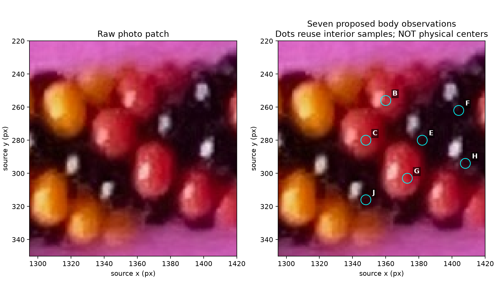
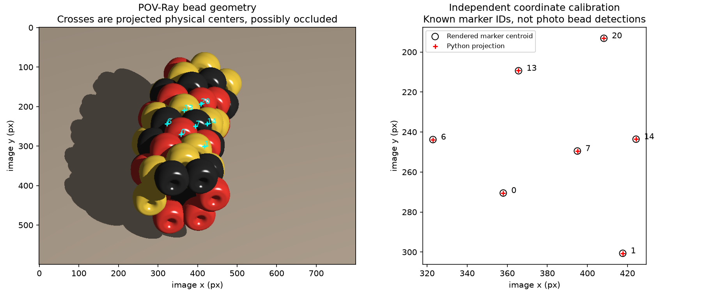
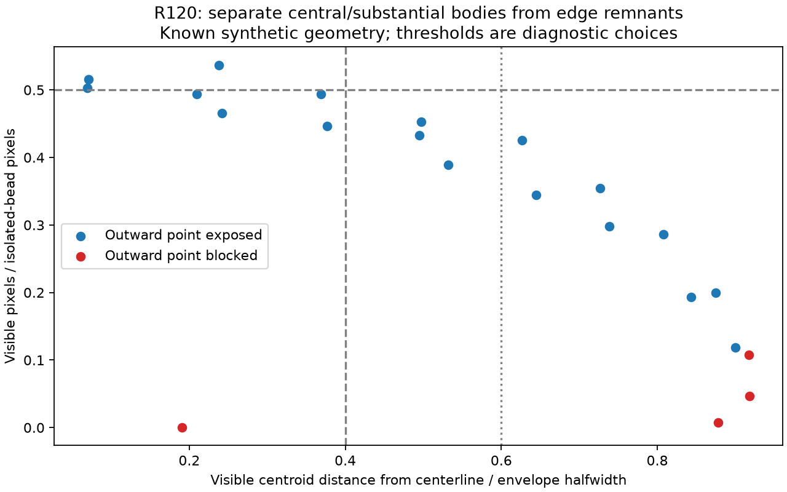

# Placement, visible surface anchors and neighbor language — R117–R125

**Later R126–R128 outcome:** the [seven-body surface fit](LOCAL_SURFACE_FIT.md)
has now been attempted, including a held-out body and perspective sensitivity.
Both neighbor charts remain tentative; the text below records the earlier
forward-calibration stopping point.

The Python forward placement now matches `beads.pov`, and signed direction counts
are available for discussing neighbors. **The seven-body photo patch has not yet
been fitted. No new photo neighbors or bead indices are established.**

Three routes were considered: fit Python placement/projection (maker method 1),
walk the six immediate neighbors (method 2), or fit a patch and initialize a walk.
Select the third route. This bounded step calibrates its forward primitives and
tests the proposed visible anchor before inverse fitting.

## Photo starting patch



B/C/E/F/G/H/J are seven assistant-selected candidates, including dark E/F/H/J.
The original disks sample interiors; they are neither physical centers nor located
outward points. A/D/I/K/L are excluded from this first fit because of edge proximity,
partial exposure or fragment uncertainty. All twelve original observation IDs
remain recorded; D is maker-confirmed separate from B. No new maker coordinates,
thresholds or pigment labels are supplied. This diagnostic selection is not an
automatic image selector. Black beads remain usable, though harder to locate.

## Independent placement and projection checks

[Python placement](bead_placement.py) ports the original loop with its literal
`sin(180/6.5)` expression (POV-Ray sine uses radians). It gives bead radius
2.110915748921366; the earlier simplified R114 synthetic radius 1.78453698 is
not silently transferred. The original scene is unchanged. An independent
major/minor-angle API also permits placement without a bead index or total N;
these geometric variables are distinct from the maker's neighbor labels.

[Checker](check_placement.py) extracts and executes the original POV expressions.
Across five N/clock/hand cases, 3,427 placements agree within 8.30e-13 scene units.
Four use the original hand, one explicitly negates minor phase to test the
extension. Counts are synthetic inputs, not estimates for photo-2.



Seven independent rendered markers agree with Python perspective projection
within 0.150 pixels. A similarity fit using three supplied pairs predicts four
held-out markers within 0.254 pixels. Reversing the three training correspondences
produces a 94.33-pixel mean held-out error. This calibrates projection and supplied
correspondences; it does not solve unknown camera pose or discover photo matches.
Pixel x is rightward and y downward; the implemented camera matches POV-Ray's
left-handed basis. [Parameters, hashes and measurements](review/r117/report.json).

## Minor-outward anchor and central-body restriction

R119 clarifies outward as the smaller torus direction, away from the local rope
centerline. The chosen point is the midpoint of each bead's outer-wall band in
that direction, on the reference torus of minor radius `chain_minor+bead_radius`.
The band has more than one equal-support point; this midpoint is an explicit
convention. It is not a highlight or an image centroid.

[Visibility checker](check_surface_visibility.py) compares that exact point with
an approximate closest-camera point sampled on the rounded annular surface.
Doubling sampling resolution moves the latter by at most 0.640 projected pixels.
Independent POV ray intersections check self and neighbor occlusion; isolated
renders supply projected visibility fractions. These known-geometry evaluators
are not a recovered photo visibility classifier or a two-point threshold rule.



In one known pose, with 61 modeled beads, ignore clipped objects and 13 indices
at each finite segment end. This guard avoids artificial exposure at open ends.
Centrality is the visible centroid's normal distance from the projected rope
centerline divided by its projected reference-torus halfwidth in that direction.
The following thresholds are diagnostic choices, not maker-supplied rules:

| Minimum visible fraction | Maximum normalized centrality | Eligible bodies | Hidden outward points |
| --- | --- | --- | --- |
| 0.25 | 0.4 | 7 | 0 |
| 0.25 | 0.6 | 10 | 0 |
| 0.50 | 0.4 or 0.6 | 3 | 0 |
| 0.75 | 0.4 or 0.6 | 0 | No evidence |

This supports trying the anchor on substantial central beads. It does not prove
visibility for every bead or pose. After the context/clipping guards, the four
cases with a visible remnant but hidden outward point have at most 10.81% of the
isolated bead area visible. That supports the maker's practical decision to skip
almost-hidden edge bodies. [Illustrated witness](review/r118/outward-counterexample.png)
and [full measurements/hashes](review/r118/report.json).

## Neighbor language, optional internal coordinates

R122–R123 propose `(n1,n6,n7)`, the signed counts of steps in each construction
direction. R124–R125 clarify that this can primarily help discussion, especially
nearest neighbors. Say “the +6 neighbor of B,” retaining a question mark when
the edge is tentative; the fitting code can use other internal coordinates.

Once the labeled relations and an origin are supported:

`bead_index = origin + n1 + 6*n6 + 7*n7`

A +7 step `(0,0,1)` and successive +1/+6 steps `(1,1,0)` have equal derived indices.
Triples are path descriptions, not unique physical IDs. Keep stable observation
IDs and unresolved components. [Consistency helper](neighbor_coordinates.py)
checks supplied local edges, alternative paths, conflicting cycles and distinct
observations assigned the same index. Four [tests](test_neighbor_coordinates.py)
pass. The [symbolic example](review/r117/direction-coordinate-example.json) uses
abstract A/B/C labels, **not** claims about the photographed A/B/C bodies.
A full necklace winding cycle requires a documented cut or verified N before
modular comparison; this helper only checks local unwrapped relations.

## Reproduce and continue

Run from the repository root with the existing Python 3.12 environment and POV-Ray:

```sh
.venv/bin/python photo2/check_placement.py --output photo2/output/r117
.venv/bin/python photo2/check_surface_visibility.py --output photo2/output/r118
.venv/bin/python -m unittest discover -s photo2 -p test_neighbor_coordinates.py -v
```

Routine scenes, renders and logs stay ignored; selected review figures and reports
are tracked. The request log records corrected camera-sign and finite-window
failures. No dependencies were installed.

Next bounded task: fit the seven-body patch using supported surface evidence,
compare pose/phase/correspondence alternatives, withhold one body or relation and
check a known synthetic counterpart. Show raw/model/uncertainty before expansion.
The circular forward prototype is not a claim that the photo centerline is circular.
Do not yet propagate around the ring, infer exact N or claim a recovered repeat.
