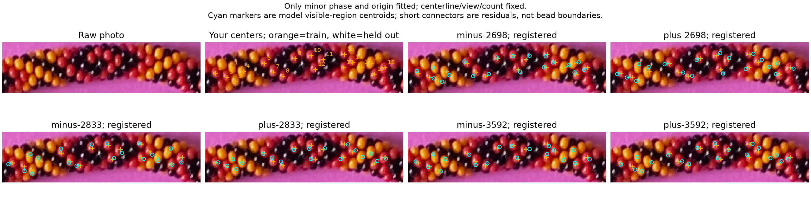
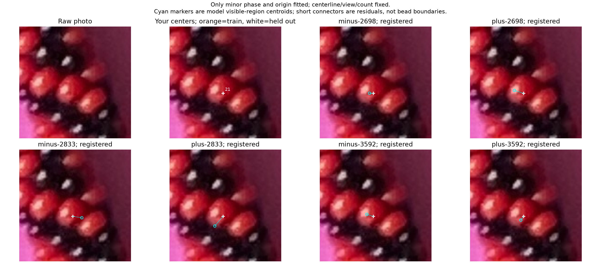
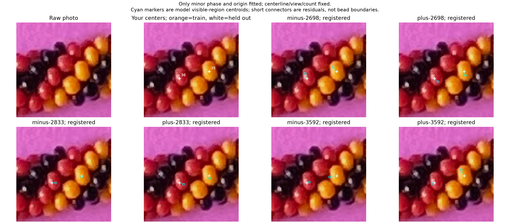
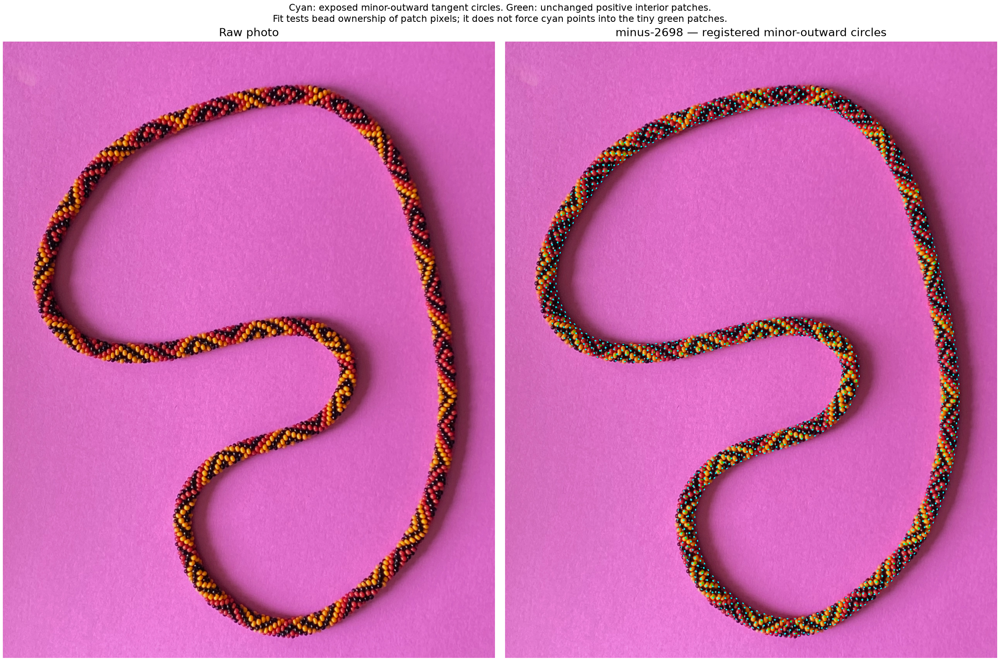
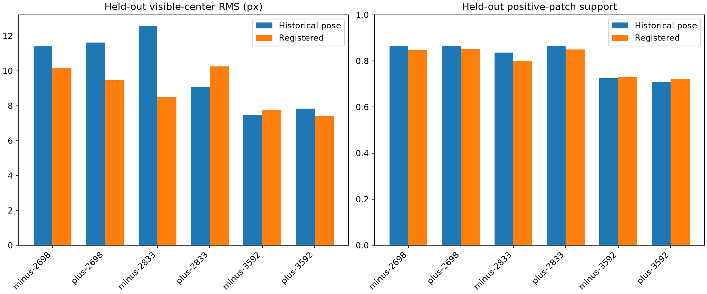

# Positive-patch registration — R214

This step fits only the model's minor-circle phase and starting position along
the necklace. It uses the existing **41 maker center marks and 208 conservative
red/yellow interior patches**, with the centerline, projection, physical bead
sizes and each count hypothesis fixed. Your confirmed M/V/O points must remain
inside one predicted bead. No complete photo outline is required.

Several alignments reduce held-out center error, but center proximity and
positive-patch support still favor different count hypotheses. **No count,
helicity or photo bead index is accepted.** All six selected trial alignments
respect your same-bead confirmation; the saved inputs remain unchanged.

## Methods considered

| Method | Useful evidence | Limitation |
|---|---|---|
| Center distances alone | Maker's visible-part centers | Can prefer too many smaller model beads; ignores patch ownership |
| Positive interiors alone | Verified pixels inside colored beads | Many tiny patches fit several possible alignments |
| Combined center and interior score | Both kinds of positive evidence | Relative weight and fixed geometry still matter |
| Alternate assignments and continuous alignment | Could refine a provisional alignment | Introduces more assignment freedom before the initial fit is checked |

Use the combined score in a finite deterministic phase/origin search, with
M/V/O's maker-confirmed same-body membership as a training constraint. This is
an assisted registration experiment, not an automatic reconstruction or a new
bead detector. [R212's scope](positive-patch-scope-r212.json) and
[R213's easier-evidence priority](easy-evidence-priority-r213.json) remain active.
Black observations remain outside this positional basis.

## Measurements and selection

The 41 marks represent approximate centers of visible bead parts. The 208
patches contain positive interior pixels; their means are not exact bead centers
or measured minor-outward anchors. Each hypothesis predicts visible-region
centroids by tracing the literal annular bead model with all beads, including
hidden ones, as occluders. The raster spacing is 2 native photo pixels. Numerical
uncertainty and nearest alternatives remain explicit, following the
[frozen correspondence pilot](VISIBLE_CORRESPONDENCE_PILOT.md).

Eight sectors use the unchanged seed spline's projected image arclength, not
calibrated physical angles. Training sectors 0/2/4/6 contain 28 center marks and
107 patches. Held-out sectors 1/3/5/7 contain 13 marks and 101 patches. M/V/O
all belong to training sector 6. Original coordinates and IDs are preserved in
[the split ledger](review/r214/splits.json).

The soft objective is

`J = mean_sector(center MSE) / D² + λ × (1 − mean_sector(patch support))`.

Here D = 27.190842 native photo pixels, the earlier image-derived apparent
diameter, and λ = 1. Each occupied sector receives equal weight; dense center
marking near the top cannot dominate the necklace. Missing center candidates
receive a squared-distance penalty of 9D² and stay in the denominator. A patch's
support is its verified dominant model-body pixel fraction, or zero if that
body's minor-outward anchor is not exposed. All original patch pixels remain in
the denominator, including unresolved rays. The stricter reported coherence
count requires at least 95% ownership by one exposed body and no unresolved ray.

Your M/V/O fact is a positive membership constraint, not a constraint on a dark
gap or an exact center. Each candidate traces the three supplied fractional
photo coordinates. A candidate is feasible only when all three verified rays
hit the same model bead. Rank feasible candidates by J; if no sampled candidate
is feasible, preserve and label that failure rather than accepting it.

The search includes 27 coarse phase/origin pairs, including the historical alignment,
then up to 16 refinements around its two best coarse candidates. It samples a
full minor phase turn and an origin interval of one model bead. Moving the
origin by a whole model bead is equivalent to shifting minor phase and relabeling
the complete model's indices; that equivalence is tested for both helicities.
Neither the gauge nor a fitted source-loop number establishes a photo bead index.
Weights 0.5 and 2 re-rank the same sampled training candidates as a sensitivity
check. Held-out scores never choose the phase, origin, hand or count.

The held-out sectors are withheld from **this** registration. Historical spline,
phase and count hypotheses already involved these parts of the photo; this is
not wholly independent prospective validation. The six counts/hands are retained
hypotheses, not six recovered bead orders.

## Raw context and comparisons

In these comparisons, orange crosses are training center marks, white crosses
are held-out marks, cyan rings are predicted **visible-region centroids**, and
short cyan connectors show residuals. They are not bead outlines.







Whole-image overlays retain the user's requested cyan circles at exposed
**minor-outward tangent points**. Green loops show the unchanged positive interior
patches. An outward point can be elsewhere within its bead than the small green
patch; fitting tests ownership, not whether every cyan circle lies inside a loop.




## Results

The arrows compare the historical pose with the selected training fit. Scores
balance occupied sectors. Patch support is a conditional model-ownership
fraction, not the percentage of photo beads recovered. The last column uses
all 208 original patches and the stricter coherence rule above.

| Hypothesis | Held-out center RMS, px | Held-out patch support | Held-out J | Coherent central patches / 208 after fit |
|---|---:|---:|---:|---:|
| minus-2698 | 11.41 → 10.16 | 86.31% → 84.63% | .3129 → .2934 | 100 |
| plus-2698 | 11.62 → 9.45 | 86.25% → 85.06% | .3200 → .2702 | 96 |
| minus-2833 | 12.58 → 8.51 | 83.67% → 80.04% | .3773 → .2975 | 93 |
| plus-2833 | 9.08 → 10.26 | 86.52% → 84.92% | .2462 → .2931 | 91 |
| minus-3592 | 7.48 → 7.76 | 72.45% → 72.99% | .3511 → .3515 | 76 |
| plus-3592 | 7.83 → 7.39 | 70.66% → 72.16% | .3763 → .3524 | 74 |

Four of six held-out joint scores improve. The original/+5% counts generally
trade better center alignment for slightly worse patch support; plus-2833
deteriorates on both. The 3592 hypotheses retain smaller center distances but
much weaker interior support. Changing the patch weight from 1 to 0.5 or 2
changes the selected sampled pose in four of six hypotheses. This is sufficient
to proceed with cautious geometry tests, not to declare an alignment recovered.

An exploratory unconstrained pass put M/V/O on different predicted beads in
three selected hypotheses. That pass was not accepted. The final search applies
the supplied same-body constraint before selecting and refining candidates;
12–25 of each hypothesis's 40–43 distinct sampled candidates satisfy it. All six final
configurations satisfy it with three verified rays. None thereby becomes a
confirmed model of the photo. The source-loop indices remain tentative.

Phase/origin registration alone has not produced a jointly convincing fit
across the necklace. A small, smooth centerline correction is a sensible next
experiment, but these measurements do not isolate the centerline from camera,
surface-model or correspondence errors. Sparse positive patches also do not
certify that 208 distinct beads, or a majority of all usable bodies, are located.



## Checks, provenance and stopping point

Independent existing POV-Ray ID-mask fixtures supply known visible centroids
and safely inset positive pixels. Starting phase/origin are deliberately
perturbed; registration uses four of eight sections and one same-body training
group, while the other four sections are withheld. These fixtures test the
inverse registration and index-gauge handling. They do not test automatic photo
detection, recover helicity/count, or validate the photo's centerline or camera.

Both fixtures pass. After the deliberate phase/origin perturbation, held-out J
falls from **.319657 to .005409** for minus-2698 and **.504800 to .000482** for
plus-2698. The maximum discrepancy between the recovered and known physical
bead positions is **0.00 px and 0.582 px**, allowing the tested index gauge.
Each fixture's training same-body constraint is satisfied. The four unit
controls cover exact gauge equivalence for both hands, sector balancing,
retaining split/hidden/missing/unknown penalties, and rejecting a better soft
score that contradicts confirmed membership.

[All six configurations, residuals and memberships](review/r214/report.json),
[sampled searches](review/r214/minus-2698-scan.json),
[known-fixture checks](review/r214/calibration.json), and
[source/output hashes and protected inputs](review/r214/summary.json) preserve
the experiment. Routine full region banks remain ignored in `photo2/output/r214`.
The photo, POV source, detector, saved labels, center marks, viewer score files,
41/208 positional references and historical evidence ledgers remain unchanged.
No live model was replaced; no photo string indices were accepted.

Reproduce:

```sh
.venv/bin/python photo2/review_positive_registration.py
.venv/bin/python -m unittest discover -s photo2 -p test_positive_registration.py
```

Stop after this registration experiment. The next bounded task is a small,
smooth centerline correction tested against positive interiors and held-out
sections, with both helicities/count hypotheses retained. Compare candidate
methods first. Keep the future zero-net local stretch requirement, but do not
add it simultaneously with the first centerline correction. Prefer clear nearby
colored evidence whenever a body is difficult. Recommend **gpt-6.1-sol / High**,
same conversation; no `/new` is needed. The user controls model/session changes.
