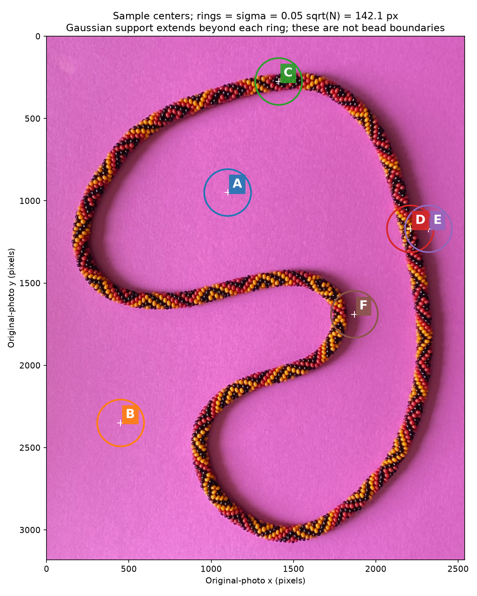
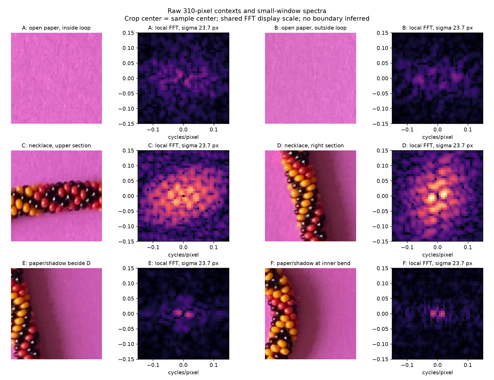

# Two questions before extending the background experiment

Updated through R097, 2026-09-27. Question 1 is partly clarified; question 2 has a
working direction from your latest reply. Your R093 feedback is saved: the later edge
correction produced implausible indents and bumps. Future contour reviews will
show small raw/candidate pairs and ask for feedback before using those contours
in later stages. No candidate outline has been adopted here.

## 1. What does your Gaussian “radius” mean?

**R097 clarification:** your background test removed the strong FFT-center peak
and inspected how much power remained. Saved and incorporated. The exact central
exclusion size and spatial Gaussian radius convention remain unspecified; the
next experiment can compare explicitly labeled alternatives without blocking.

You specified `0.05 × sqrt(total pixels)`, about **142 pixels** for this photo.
In this illustration, the rings show that distance from each sample center:

I initially used it as the **sigma of a spatial Gaussian window before the FFT**,
which extends well beyond each ring and mixes necklace into nearby paper samples.
Did you intend **that**, a **window's outer radius** (with a smaller sigma), or
a **Gaussian blur / frequency filter**? A reference to your explorer settings
would also answer this. I have retained all three tested window scales.

## 2. Which method should lead the next small comparison?

**R095 response:** “I agree, I am not sure a good way to do the boundary, perhaps
increasing smaller fft radius?” Interpreted as agreement to the small comparison
and a suggestion to try progressively smaller FFT windows near the boundary.
This does not settle question 1's precise Gaussian definition or label any edge.
The next experiment will compare window scales along a short paper/necklace
transition, alongside spatial texture, and display an uncertainty interval.
The original question and context follow for provenance; no repeat answer needed.

The [five-method table](BACKGROUND_METHODS.md#five-methods-to-consider) compares:
FFT texture, spatial texture, learned paper appearance, user-labeled region
segmentation, and a joint smooth rope/contour fit.

My suggestion is **FFT versus spatial texture, with a few reviewed labels**,
before fitting an outline. The raw crops and FFTs below show why: paper has its
own texture, and windows beside beads can include both paper and necklace.

Would you start with that comparison, prioritize another of the five, or add a
missing method? The next review will be a small set of illustrated patches,
stopping before a whole-image contour or spline. No need to answer the older
branch's entire edge-question set to discuss these choices.

The R095 wording is saved verbatim above and in the request log; R097's FFT
clarification is saved there too. The proposed
progressive-shrink interpretation is explicit; no exact radius or edge is confirmed.
