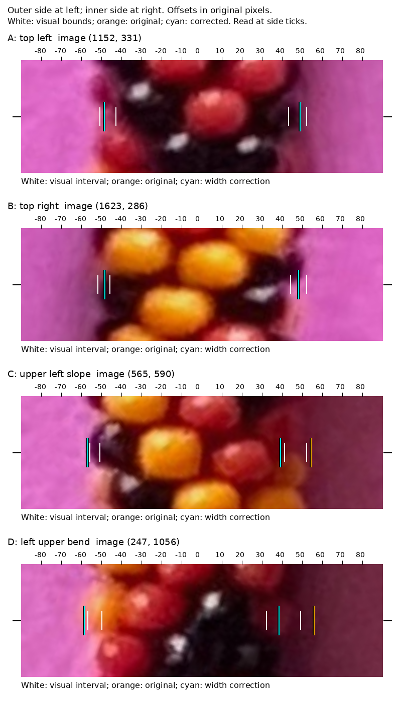
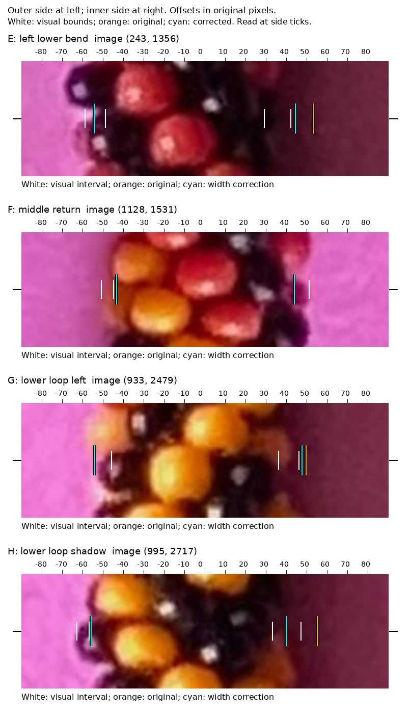
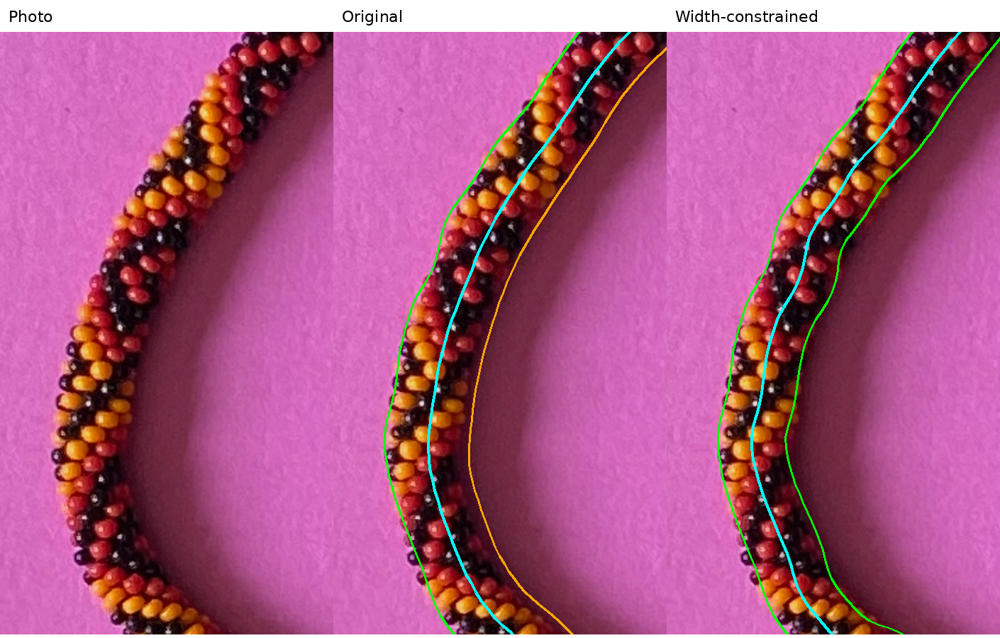
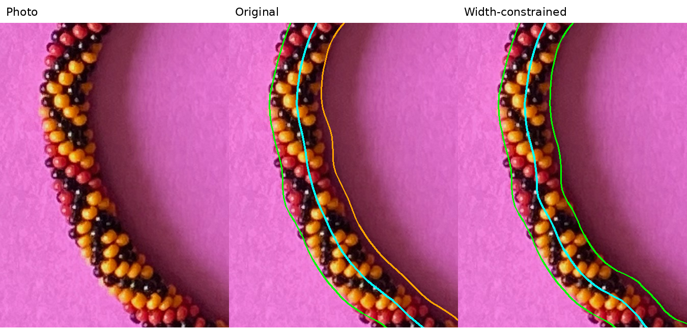
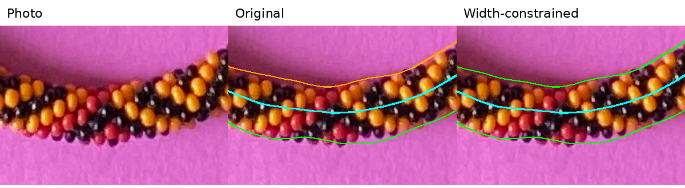

# Questions for reviewing the shadow correction

2026-09-24 — saved here as requested in R064–R065. This file and its
supporting illustrations are committed; future questions will follow this format. These consolidate the two opening
image-advice questions and the completed comparison. No further pattern or
construction information is being requested.

## R066 follow-up evidence for the same pending questions

No maker answers have been received. The three questions below remain open;
this step adds closer views rather than another set of questions. The
[new transect review](review/r066/review.html) has raw images, comparison overlays
and [lettered locations](review/r066/locations.png). White brackets are my visual
edge estimates, orange is the original boundary and cyan the proposed boundary.
Read the horizontal midpoint marked by the side ticks. Coincident orange/cyan
lines appear cyan. These estimates are not confirmed ground truth.

For question 1, **C** may move slightly too far into a bead, while **D** supports
the leftward correction. For question 2, **E** may still leave some shadow inside
the outline, and **H** supports the lower-loop correction. For question 3, **F**
shows how a small bead scallop can disagree with an otherwise clear-looking edge.
Please use those letters if they help explain your answers to the questions below.

## Original pending questions (R064–R065)

Open the [illustrated review page](review/r064/review.html)
for the comparisons, numbered whole-image map and width plot. Measurements use
original-photo pixels. Cyan is the centerline, green the proposed boundaries,
and orange the original inner boundary. These are provisional corrections.

1. **Leftmost bend:** In the [left comparison](review/r064/left-comparison.png),
   does the right-hand panel's green inner edge follow the actual bead edge
   more closely? Does the cyan centerline look centered now, or has it moved too
   far left? The typical proposed center shift here is about nine pixels.

   

2. **Other shadowed sections:** The [lower-loop comparison](review/r064/lower-loop-comparison.png)
   shows a similar suspected error, marked **2** on the
   [whole-image map](review/r064/shadow-overview.png).
   Do you recognize this as the same shadow problem? Please point out any
   numbered area where the proposed boundary seems to cut into real beads,
   or an unmarked area that also needs correction.

   

3. **Width reference:** Which part of photo 2 would you trust most for measuring
   the full bracelet width, with both actual bead edges visible? The
   [bottom reference crop](review/r064/bottom-reference.png)
   illustrates a section where some automated quality checks fail. Is that a
   good reference anyway, or is another part clearer? Current clear-section
   widths cluster near 96 pixels, but they do not yet establish the expected
   top-to-bottom perspective trend.

   

[Numbered overview of the 14 flagged regions](review/r064/shadow-overview.png).

Answers by question number or map-zone number are enough. Saved answers will be
carried into the handoff so they are available in a fresh conversation.
