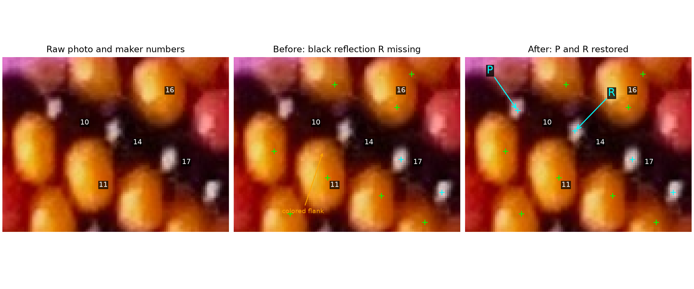
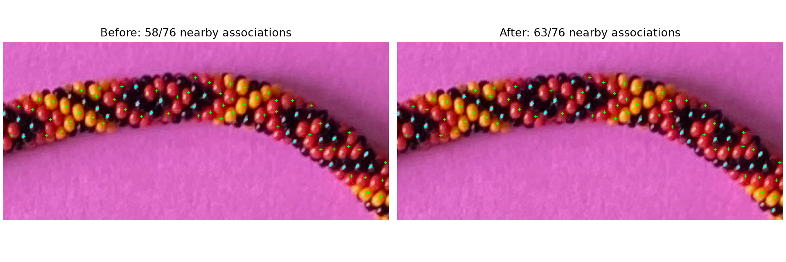

# Recovering nearby black-bead reflections — R169

The detector now checks a reflection's surroundings before applying bead-scale
suppression among accepted dark-surround reflections. In the frozen photograph,
this preserves the 908 baseline positions and adds 50 reflection proposals.
Black bead14's recovered point R lies inside its previously maker-confirmed
interior; that ownership is established without another question.

## Q169.1 — Ownership of recovered reflection P

In the **after** panel, does cyan **P** lie inside the same black bead as the
maker's existing number **10**? Only P's bead identity is being asked about.
R's ownership on14 already follows from the confirmed core. Neither reflection
is being claimed as a boundary, physical center or exposed outward anchor.



**R170 answer:** “Yes, P is inside bead 10.” The recovered P location therefore
has [maker-confirmed ownership](reflection-confirmed-r170.json). R belongs to14 by the prior confirmed core, and
the unchanged reflection on17 also lies inside its confirmed core. The program
reproduces the supplied10→14→17 d2 chain. This does not verify all other proposed
links, unit string offsets, full bead extents, outward anchors or helicity.

The crop is [1240,245,1350,330] in EXIF-oriented original pixels, x right/y down.
P=(1265.52,270.96), R=(1293.37,280.91). The summary preserves exact coordinates,
stable automatic IDs, source/script/image hashes and the old confirmed core.
Green marks are chromatic-interior proposals; cyan marks are reflection proposals.
Arrows identify locations, not outlines. Maker numbers come from frozen revision422.

## Mechanism and evidence

Four possibilities considered: weaker reflections with dark context, brightness
seams for joined chromatic regions, supported missing-neighbor searches, and
projected bead templates. Diagnose first and choose the reflection-context change.
The missed reflection on14 is strong (.24305 filter response). The old five-pixel
maximum-filter square includes a brighter colored-highlight flank (.24508),
which removes14's local peak before appearance classification. More permissive
brightness thresholds alone would not restore it. P has the same class of failure.

Keep the existing value filter, learned threshold, chromatic association checks,
dark surround, approximate band-edge exclusion and bead-scale suppression radius.
Extract local peaks at two-pixel spacing, apply appearance/context tests, then
suppress nearby accepted dark-surround reflections. Use the inclusive original
maximum-filter radius. No saved maker coordinates, palette boxes or core masks
enter detection. All 642 chromatic proposals remain unchanged.



Freeze a new exact maker save: revision422,76 locations,41 series,129 completed
links, SHA `1a99b514b07707176b18ec5f9d2790ddbdb33e060dbcfd9884599f49b17137ff`.
The live file stays untouched and can keep advancing. Replay committed baseline
3a74cdf and the new detector on the same pixels before reading the evaluator.
Nearby one-to-one associations rise58→63/76; forward matching links44→49/129.
These are proximity-based associations, not proof of every bead identity.
The automatic point in confirmed core14 provides stronger identity evidence than
proximity. The recovered14→17 d2 relation agrees with maker labels and both points
lie in confirmed interiors; the supplied11→14 d3 link remains unresolved.

The photo now has958 proposals (642 chromatic/316 reflection-dark) and1462
tentative links. Graph components45→37; largest component192→204. Retain17
isolated bodies,62 ambiguous choices and190 possible skipped-step links. The510
rejected edge features are not510 excluded beads. No verified full loop, helicity,
N, full-string indices or color repeat. No full bead boundaries are fitted.

## Known-source checks and the tradeoff

Use the same independent source-macro appearance/ID fixtures from R167. ID pixels
are evaluator-only; eligible area threshold and material/camera parameters remain
unchanged. Keep existing fixture reports separate using `--fixtures` with `--reuse`.

| Known fixture | Eligible located, before→after | Duplicates, before→after | True unsigned neighbors / links, before→after |
| --- | ---: | ---: | ---: |
| Hand +1, blue/amber/black | 130→132 /168 | 4→4 | 273/281→280/292 (97.2→95.9%) |
| Hand −1, same appearance | 130→133 /168 | 4→4 | 268/274→271/279 (97.8→97.1%) |
| Hand +1, changed palette/background/placement | 132→133 /169 | 3→3 | 276/285→279/291 (96.8→95.9%) |

All three still place zero proposals on paper. Body coverage improves, but the
additional graph links include wrong neighbors; this is a coverage/adjacency
tradeoff, not a uniform accuracy improvement. Keep those links tentative. The
figures and [full frozen summary](review/r169/summary.json) preserve failures
alongside gains. Reflection positions differ from physical bead centers/outward
anchors, so local geometric nearest-neighbor inference remains uncertain.

## Reproduce and inspect

```sh
.venv/bin/python photo2/auto_label_beads.py --output photo2/output/r169/context-first --validation photo2/manual-labels-r169.json
.venv/bin/python photo2/check_auto_labels.py --reuse --fixtures photo2/output/r167/calibration --output photo2/output/r169/calibration
.venv/bin/python photo2/review_reflection_suppression.py
```

Choose a fresh output directory or use `--replace-proposals` only for unchanged
revision-zero generated proposals. Original live and reviewed files are protected.
To create the controlled fixtures on a fresh checkout, first run
`check_auto_labels.py --output photo2/output/r167/calibration`; the comparison
script uses frozen tracked R167 metrics for its baseline and replays the pinned
Git detector for the photo. Routine full reports/renders stay ignored.

Open the new separate proposal file:

```sh
.venv/bin/python photo2/label_beads.py --full-image --annotations photo2/output/r169/context-first/annotations.json --port 0
```

New automatic numbering can shift as points are inserted; compare stable IDs/
coordinates, not numbers across runs. Historical Q167.1's448/449/450 remain tied
to that frozen figure and their stable IDs; the maker's original numbers stay
unchanged. This step does not modify that original live save or its source image.

Validation: all 11 automatic-label and LabelStore tests pass, including the new
regression for bead14's confirmed interior. A run without the maker evaluator
produces identical proposals, IDs, learned parameters and adjacency. The actual
LabelStore loads the new958 locations/1462 series. No launcher test was run.

**Stopping point:** one reflection-suppression correction, paired photo/render
checks and a small ownership review. **Next bounded task:** use the accepted
interior identities to diagnose missing/wrong neighbor links (including11→14 d3)
before enlarging the geometric fitting or making a hand claim. Recommend
**gpt-6.1-sol / High**, same conversation; no `/new` needed.
