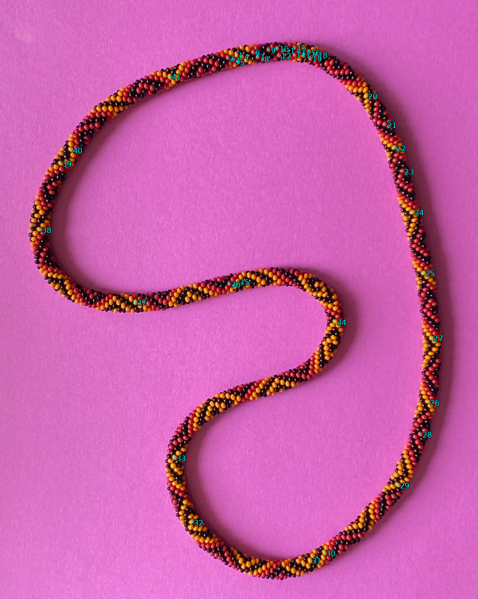
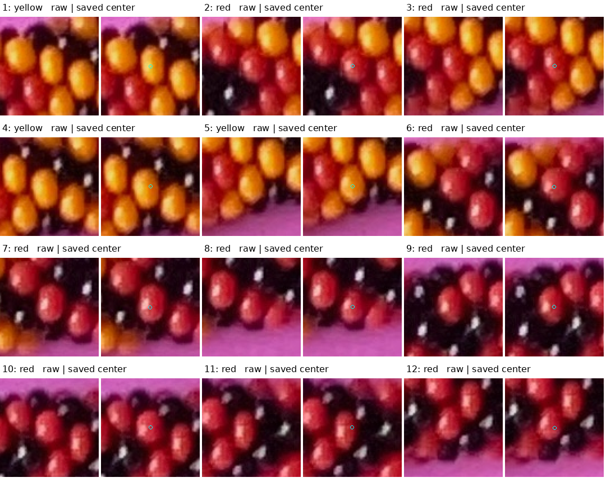
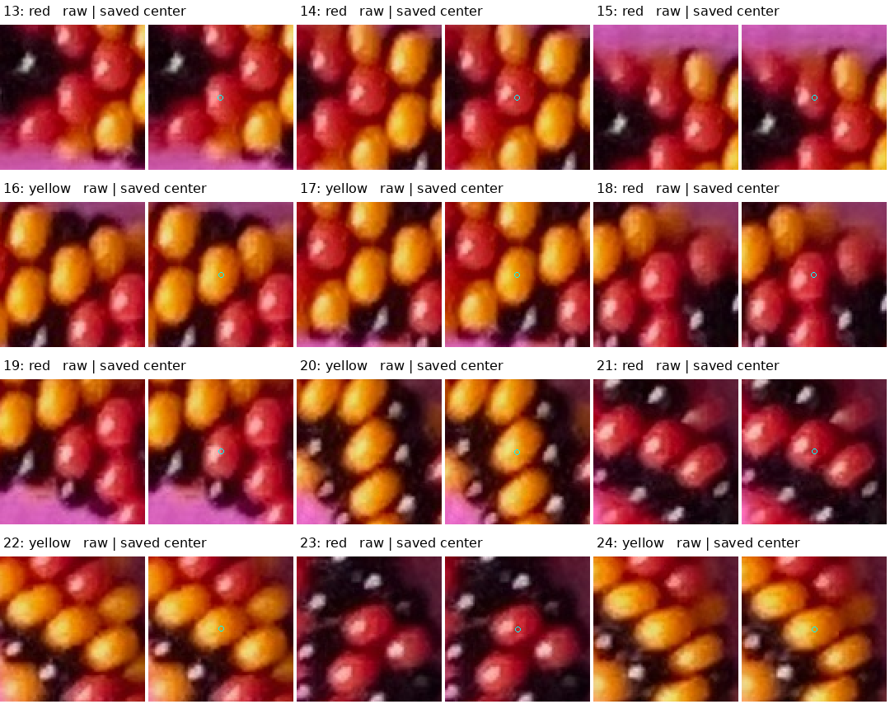
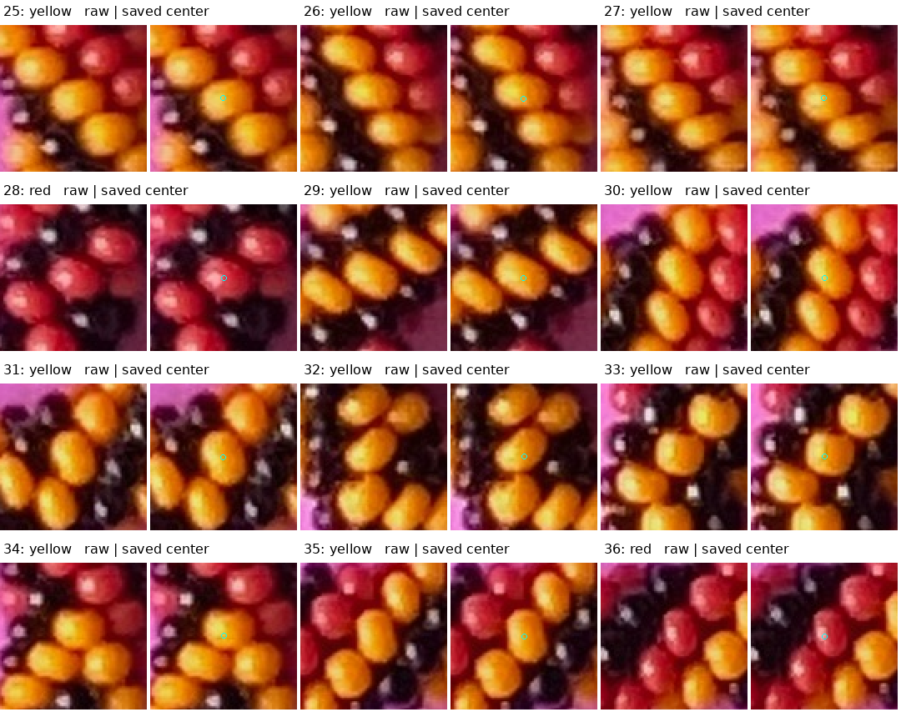
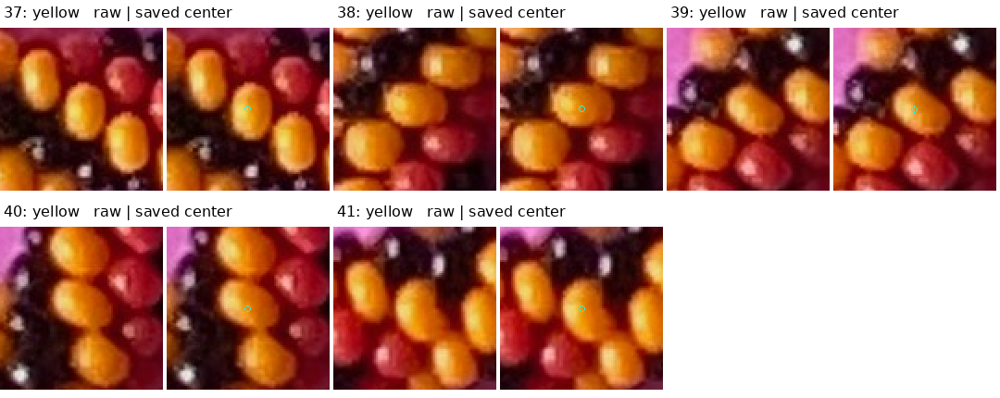

# Saved centers provide an initial position basis — R200

Your 41 saved visible-part center marks lie on **18 red and 23 yellow beads**.
Raw-image inspection supports keeping all 41 as assisted starting references.
They cover the whole loop sufficiently to begin a correspondence trial without
requiring difficult black beads or a complete inventory. This is a quality and
coverage audit; **no correspondence or centerline adjustment is performed yet**.



The cyan rings mark your exact saved locations. Numbers belong to the center
viewer, independently of the older bead labeller, automatic observation numbers
and model generator indices. Dense top labels can be read in the crops below.
The snapshot is identical to the live saved centers, revision 2, SHA256
`3d210bea246d9942cdb38e66600d71485561821f80594a3dfbd447ac8256c55d`.
No live save was rewritten.

Four methods compared: raw crops at every mark, local circular hue/S/V,
existing automatic proposal context, and distribution along the unchanged seed
curve. Raw crops and maker-selected positions lead this audit. Appearance and
proximity measurements are supporting diagnostics, not automatic trust gates.
No new question is needed to repeat your existing choice of these center marks.

## Raw evidence at every mark

Each pair shows the same 88×88 native-pixel crop enlarged twice using nearest
neighbor sampling: unmarked raw pixels on the left, a tiny cyan ring at the saved
position on the right. No whole-bead boundaries or new confirmed interior loops
are drawn. These are visibly substantial colored parts rather than ambiguous
black areas or paper slivers. “Suitable” refers to a starting visible-center
proxy, not a precise physical center or minor-outward surface point.









The [position basis](review/r200/position-basis.json) preserves every stable ID,
number and coordinate without adjustment. Color names are this review's visual
interpretations, supported by the image-derived hue modes from the frozen R192
inventory. They are not newly supplied maker color labels or full-string indices.
No new positive region is added to the existing trusted interior ledger.

Within a three-pixel disk around each saved point, sample native JPEG RGB,
convert HSV to 0–1, and average hue on the circle with saturation weights to
reduce white-glint influence. All marks have hue resultants above 0.9976; median
S ranges 0.513–1.0 and median V ranges 0.571–0.937. The nearest learned mode
differs by 0.48–18.30 degrees. These measurements support the red/yellow reading
in the raw context; they do not certify every disk pixel's seam clearance.
Prior paper/bead HSV overlap still applies.

For comparison, retain the nearest frozen automatic seed's ID, kind, status and
distance. Distances range approximately 3.3–20.2 pixels. Center **12 is red**,
but its nearest seed is an edge-excluded dark/reflection proposal. This is a
concrete reason to preserve your marks independently: a nearest seed is neither
a reliable body association nor a reason to relabel or reject the saved point.
No automatic region or alias is promoted.

## Coverage and the next fit

For coverage only, sample the original periodic seed spline at 8193 points,
using its existing two-pixel smoothing setting. Project each mark to its closest
sample and normalize cumulative **image arclength**. The eight equal image-arc
sectors contain 4, 2, 2, 3, 1, 3, 21 and 5 marks; all sectors have support.
Nineteen marks form the dense top patch; the remaining 22 provide wider coverage.

The largest gap lies between centers **33 and 34**, about **12.93%** of image
arclength, across the inward bend. This is not a 46.5-degree physical major-axis
measurement: the loop is noncircular and the camera geometry is uncertain.
The old spline supplies approximate coverage ordering only; it is not refitted
or certified by this calculation. Areas between sparse marks remain less
constrained, especially that bend. The earlier rejected green curve stays rejected.

This is enough evidence to try initial correspondence and small smooth planar
centerline adjustments. A fit should balance spatial coverage so the top cluster
does not dominate, and compare both helicities without treating a score minimum
as established N. Your visible-part centers and predicted minor-outward points
remain different targets; their offsets must be inspected before curve movement
is interpreted as a correction. The 41 positions alone do not supply exact
indices, adjacency, camera calibration, uncertainty bounds or uniqueness of a
fit. Complete all-bead recovery is not a prerequisite. The saved zero-net stretch
suggestion remains unimplemented.

## Reproduction and checks

```bash
.venv/bin/python photo2/audit_saved_centers.py
.venv/bin/python photo2/audit_saved_centers.py --output photo2/output/r200/repeat
```

The [script](audit_saved_centers.py) is explicitly an assisted curator, using
saved manual positions and the old seed for this diagnostic. Its visual
dispositions are sealed to the exact inspected center-file hash; changed marks
require a new visual audit rather than inheriting those dispositions. This is
not an image-only reconstruction or a claim of automatic generality.

All curated artifacts and summary repeat byte-for-byte. Source/photo binding,
41 preserved unique IDs/coordinates, color totals, sector totals, unit-sum cyclic
gaps, empty correspondences and syntax were checked. Ten protected source/live
input hashes match R196; original photo, POV scene, detector, tangent model,
spline, annotations, centers and scores remain unchanged. All raw crop panels
and the whole-photo view were inspected. [Source/output and preservation hashes](review/r200/summary.json).
No GUI/server test, new render, count scan, phase/camera/stretch change or fit.

Stopping point: the saved colored centers form the assisted starting position
basis. Next bounded task: initial model correspondence with spatially balanced
residuals, then a small constrained centerline trial and raw-overlay review.
Recommended model/reasoning: **gpt-6.1-sol / High**, same session; no `/new`.
