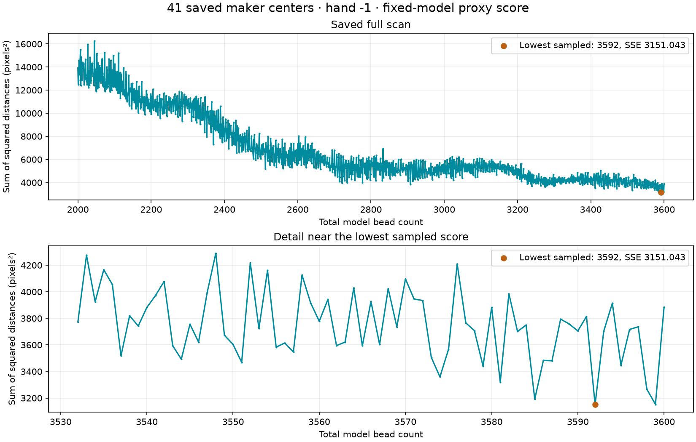

# Saved scores, graph zoom and restoration — R186

Your **41 saved centers** and completed **1601-count scan** have been found.
The current centers are revision2; the scan used revision1. Their IDs, numbers
and positions are identical, so the saved graph is applicable to the latest
centers. No point, score, revision or backup was changed during this work.
Frozen copies preserve the [latest centers](review/r186/centers.json) and
[existing score](review/r186/centers-score.json), including its original model
settings and code hashes. [Capture/validation record](review/r186/summary.json).

Restart the running viewer with Ctrl+C, then run and reload its page:

```bash
.venv/bin/python photo2/tangent_viewer.py
```

All41 marks and the saved graph appear automatically; **no new scan or save
is needed**. If there is no separate saved viewer choice, the model count,
helicity and guide settings restore from the centers' saved reference. Your
current reference count is2646,hand−1. Explicit CLI count/hand overrides and
a saved viewer choice still take precedence. Photograph framing remains as
before; this does not invent a saved pan/zoom absent from the center file.

- **Larger graph** opens a wide graph window. Return to photo or Escape closes
  it. Clicking a tested count selects that model count and returns to the photo.
- Wheel zooms both axes around the pointer. **Shift-wheel** zooms only the
  vertical score axis; **Ctrl-wheel** zooms only the horizontal count axis.
- Drag pans the graph. Dragging does not select a count. The **+ / −** buttons
  zoom around the graph center; hover shows count, SSE and RMS to three decimals.
- **Fit graph** restores the full scan. **Fit scores** fits the vertical axis
  to the currently visible count interval. **Best ±30** focuses near the lowest
  sampled score, fitting both axes to that neighborhood.
- View from/to and **View range** zoom into an exact interval of existing
  samples. These fields do not rescan or change the scan's From/To settings.
- Graph PNG exports the displayed zoom. Score JSON retains every original
  sample. The browser remembers graph zoom for this saved scan when local
  storage is available; moving between large/small views retains the domain.

Three approaches were considered: narrow rescan, zoom existing scores, and a
larger graph view. Implement the latter two together. Use a separate graph-domain
view, pointer-anchored transforms, clipped curve drawing and bounded pan/zoom;
keep all original scores and photograph coordinates unchanged. One-count minimum
horizontal span and finite nonzero vertical spans prevent degenerate zoom.

## Existing maker score



This is the saved hand−1 scan, every integer2000–3600. Its lowest sampled SSE
is **3151.042778 pixels² at3592**, RMS **8.766681 pixels**, using all41 marks.
The lowest point lies near the upper scan boundary; it does not establish the
actual total count. Distinct nearest predictions can change with N, and growing
prediction density can favor larger counts. Phase, imperfect centerline and
visible-center versus outward-point bias remain fixed-model limitations.
No new scan, phase/spline fit, helicity result or recovered photo indices are
claimed by this viewer improvement. The static plot reproduces existing data.

Restoration requires the saved score's points to match the current center file,
independent of a revision increment caused by saving identical points. A score
for different points is retained on disk and flagged for recalculation; it is
not silently displayed as current. Read-only restoration does not rewrite files.
Plotting already saved, unchanged points no longer resaves them merely to scan.

Fourteen Python tests and ten named JavaScript checks pass. New tests cover
restoration of identical points across revisions without writes, rejection of
different-point score reuse, saved center reference count, graph pointer zoom,
independent axes, pan bounds, extreme zoom, nearest-sample lookup, visible-range
score fitting and immutable data. Existing model/mark/viewport checks also pass.
Live read-only restoration verified41 centers/1601 scores/count2646, with hashes
of all three original saved files unchanged. Syntax/record hashes checked and
the plotted figure inspected. Browser/server/launcher interaction remains
untested; no GUI launched. Old geometry/POV/photo/manual adjacency files remain
unchanged.

```bash
.venv/bin/python -m unittest discover -s photo2 -p test_center_marks.py
.venv/bin/python -m unittest discover -s photo2 -p test_tangent_viewer.py
node photo2/tangent_viewer/score_view.test.mjs
node photo2/tangent_viewer/marks.test.mjs
node photo2/tangent_viewer/viewport.test.mjs
.venv/bin/python photo2/review_saved_scores.py
```

Stopping point: restore saved centers/scores and inspect the graph interactively.
Next task: review individual low-score hypotheses and their proposed matches
before deciding whether to extend the scan or refine geometry. Recommended
model/reasoning: **gpt-6.1-sol / High**, same session, no `/new` needed.
