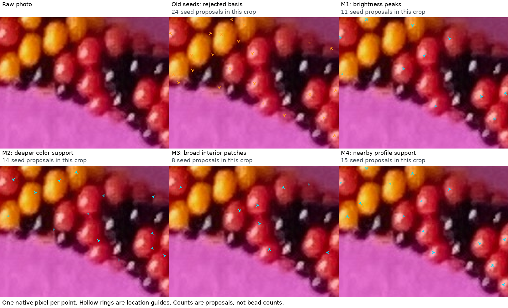
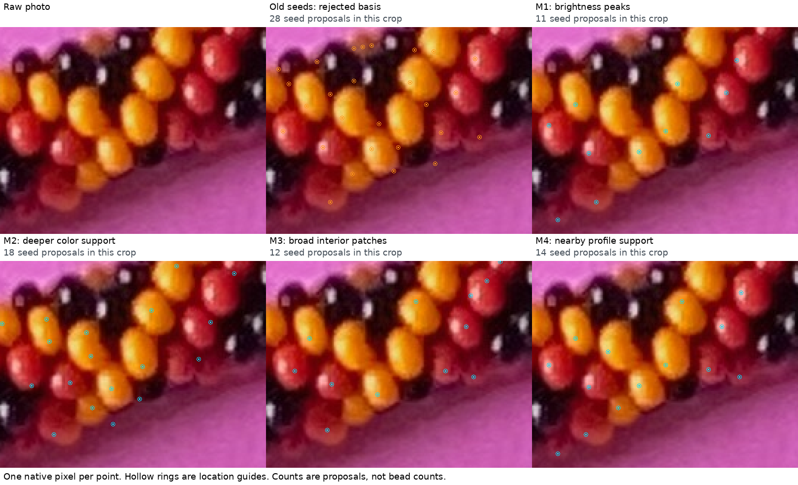
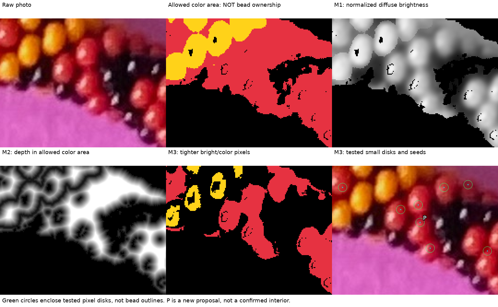
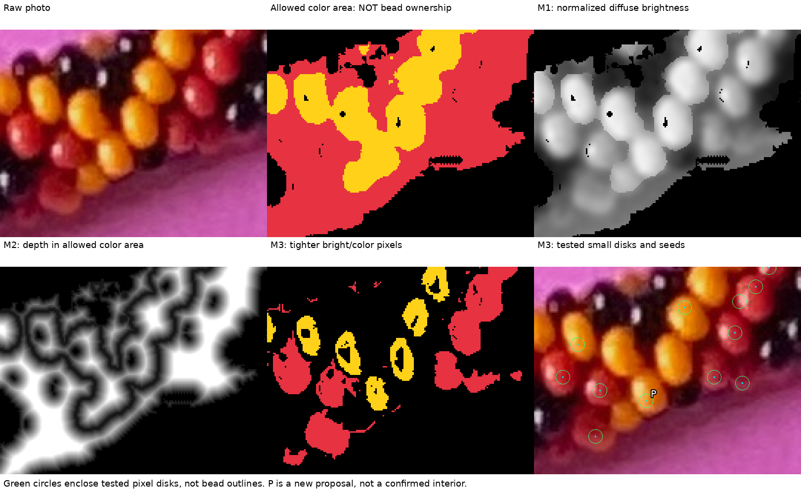
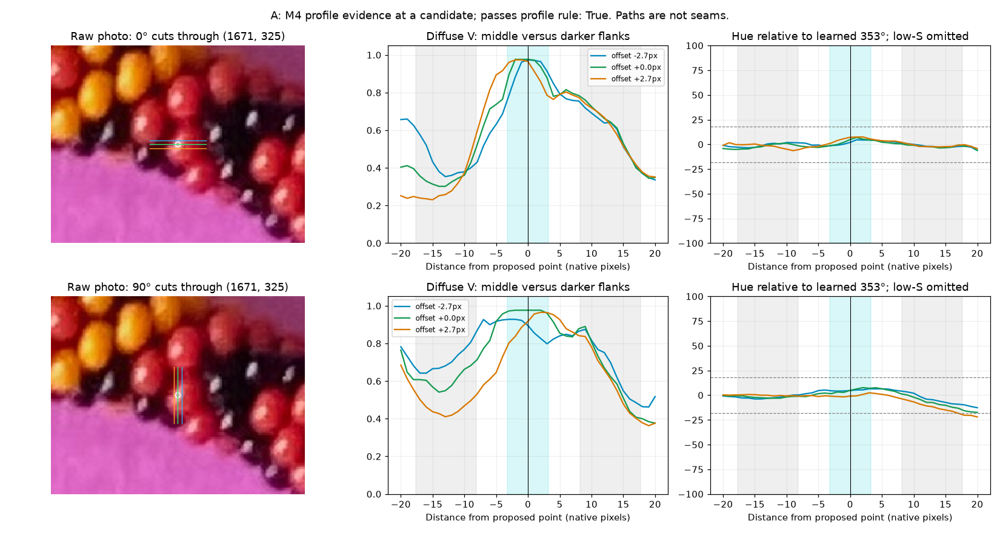
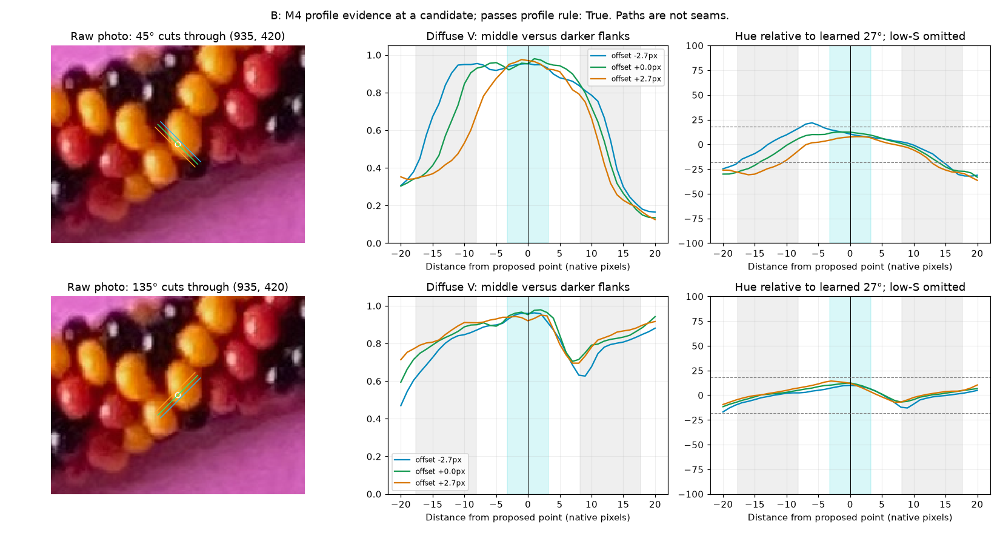

# Four possible repairs to seed selection — R231

Open **http://127.0.0.1:4001/seed-methods.html** with your existing server still
running. No restart is needed. The [self-contained viewer](review/r231/index.html)
also opens directly. Choose a method and a context, zoom, scroll to pan, and
click near a point to read its method-specific number and native coordinate.

The four approaches were announced before implementation. They are experimental
seed selectors, with no production winner chosen. Each runs across the whole
photo using the same frozen image-derived appearance information. No manual bead
labels, series, saved centers, old centerline or position model is an input.

Start with these two enlarged comparisons. Each has the raw photograph, the old
rejected seeds, and the four alternatives in exactly the same crop. **Cyan marks
one native pixel; hollow rings are location guides.** The old seeds are orange.
Seed counts are proposals, not established bead counts.





| Method | What changes | Whole-photo proposals | Main weakness to inspect |
|---|---|---:|---|
| M1: brightness peaks | Smooth brightness using only allowed-color pixels; choose prominent bright hills without the old distance multiplier or fallback | 537 | Can miss shaded bodies; still depends on the allowed-color mask |
| M2: deeper color support | Reward greater distance inside the broad color area; require at least 4.9 pixels of inset | 926 | A merged color area can still put a deep point between beads |
| M3: broad interior patches | Require a small disk of bright, saturated, hue-compatible pixels around the point | 431 | Strict brightness and patch width can omit clearly visible beads |
| M4: nearby profile support | Require a broad colored bright middle and darker flanks on several nearby cuts in two perpendicular directions | 599 | Can miss flat or dim bodies; within-bead shading can resemble a hill |

## M1 — brightness peaks with restricted smoothing

The old score multiplied brightness by distance inside a permissive color area,
creating peaks that could depend heavily on the mask's shape. M1 instead uses
brightness itself. Its Gaussian average divides by the amount of supported
color in the neighborhood, so unsupported paper cannot directly raise that
average. Paper incorrectly admitted by the color mask can still contribute.

Keep prominent hills above the learned family's 65th-percentile diffuse
brightness, require a modest support inset, and suppress same-family points
within half an apparent diameter. Reflections help the appearance calculation
but are not selected as seed pixels. This is a simple candidate worth checking
for clear interiors and lost shaded beads; it does not prove one seed per bead.

## M2 — uncapped depth, with a larger inset

M2 moves the preference toward thicker parts of the color area. Unlike the old
distance term, its distance score keeps increasing beyond about three pixels.
It requires an inset of 0.18 apparent diameters, about 4.9 native pixels here,
and a weak diffuse-brightness floor. Deep maxima are chosen, with the same
half-diameter spacing as the other alternatives.

This directly tests whether the old small inset was the main problem. It also
exposes the limitation of using the same broad mask: depth in a joined area is
not established bead-interior depth. Compare M2 with the raw crop and with the
allowed-area/depth panels below, rather than accepting its circles as centers.

## M3 — a tested small interior neighborhood

M3 first tightens hue to 12 degrees from the learned family, raises saturation
to 70% of the learned saturation floor, and requires diffuse V above the larger
of the family's 65th percentile and 60% of its Q90. Previously attached neutral
reflections can support the mask, but are not chosen as seed pixels.

Then require a disk of radius 0.17 apparent diameters, about 4.62 pixels, to
pass those pixel tests. Here each disk contains 69 native pixel centers.
The green circles show these tested neighborhoods, **not bead boundaries** or
70–90% visible masks. This makes the proposed supporting interior inspectable.
It is intentionally strict: A has no M3 yellow proposals, so missed clear yellow
beads are an important coverage cost. Passing the pixel tests does not establish
that a disk belongs to one actual bead.





A [looser M3 comparison](review/r231/loose-patch-a.png) uses the larger of Q35
and 45% of Q90 instead. It yields 751 whole-photo proposals, compared with 431
for the stricter version, and retains wider connected colored areas. The
[probe record](review/r231/loose-patch-probe.json) preserves the exact parameters,
source/output hashes and reproduction command. More points alone do not show
that the method is better. This comparison concerns brightness conservatism,
not a change to the frozen production masks.

## M4 — use small one-dimensional neighborhoods together

M4 checks the union of the old automatic seeds and the three new point sets.
For each candidate, sample three parallel cuts at offsets 0 and ±2.7 pixels.
Check horizontal/vertical cuts and the two perpendicular diagonals. A direction
passes when at least two of its three cuts have a sufficiently bright, mostly
same-family middle, with lower brightness on both flanks. Two perpendicular
directions must pass. This supports a two-dimensional interior using simple
local profiles, without establishing seams or adjacency.

The middle spans about ±3.3 pixels; flanks are sampled 8.2–17.7 pixels away.
The brightness drop must be at least 10% of the middle value and at least 0.04
on the 0–1 V scale. Hue and saturation help exclude neutral glints and wrong-color
features. RGB is interpolated before conversion to HSV; hue wraps correctly.
The graphs below show the actual paths and values at candidates, not a guessed
bead outline. The candidate can pass this rule without surviving final spacing.





## Additional areas around the necklace

The additional crops were selected after extraction from angular sectors and
median radius of the old automatic proposal set, independently of the new
methods' success. They are diagnostic views, not runtime coordinate priors.
All full-photo proposals remain available in the viewer.

| Area | Raw/seed comparison | Intermediate evidence |
|---|---|---|
| Right | [All methods](review/r231/comparison-right.png) | [Fields and disks](review/r231/evidence-right.png) |
| Lower right | [All methods](review/r231/comparison-lower-right.png) | [Fields and disks](review/r231/evidence-lower-right.png) |
| Bottom | [All methods](review/r231/comparison-bottom.png) | [Fields and disks](review/r231/evidence-bottom.png) |
| Lower left | [All methods](review/r231/comparison-lower-left.png) | [Fields and disks](review/r231/evidence-lower-left.png) |
| Left | [All methods](review/r231/comparison-left.png) | [Fields and disks](review/r231/evidence-left.png) |

## Two review questions

**Q231.1:** In the A and B comparisons, which of M1–M4 seems most promising for
reliable bead-interior points? Mention obvious points in gaps and clear colored
beads that are missed, if convenient.

**Q231.2:** In A's intermediate-evidence figure, does the small green disk
labelled P stay comfortably inside one red bead? This asks about that exact
69-pixel disk only, not the other disks or the full method.

[As-issued image hashes, point lists and native disk pixels](seed-method-questions-r231.json)
are preserved. Both questions are pending. None of these new extents inherit
confirmation from old seeds or earlier masks.

## Checks and limits

Four existing development scenes cover both hands and changed palette,
background and placement. All proposals are finished before known-owner images
are opened. Every new seed lands on a colored body in these controls; all 270
M3 disks stay within one known colored body. Their eligible-body coverage differs:
M1 covers 258/450, M2 416/450, M3 268/450 and M4 427/450. Multiple seeds on one
body remain possible.

**The old seeds also pass seed ownership in these controls.** Therefore the
controls do not reproduce the maker's photo failure or establish a photo error
rate. Your raw-photo review remains essential. These are previously used scenes,
not independent holdouts or proof of generality. [Full measurements and misses](review/r231/calibration.json).

Sources, learned thresholds, native point lists, crop selection and payload hashes
are in the [summary](review/r231/summary.json), [point ledger](review/r231/points.json)
and [review locations](review/r231/review-locations.json). The production extractor,
its original seeds/masks/reflections and geometry remain unchanged. There is no
region growth, centerline fit or bead-index inference in this comparison.

```sh
.venv/bin/python photo2/compare_seed_methods.py
.venv/bin/python photo2/check_seed_methods.py
.venv/bin/python photo2/compare_seed_methods.py --patch-rule loose --output photo2/output/r231/loose-review
```

Stop at the illustrated comparison. Next preserve the maker's preferred methods
and specific successes/failures, then choose a seed correction. Recommend
gpt-6.1-sol / High; same conversation, no `/new` needed.
