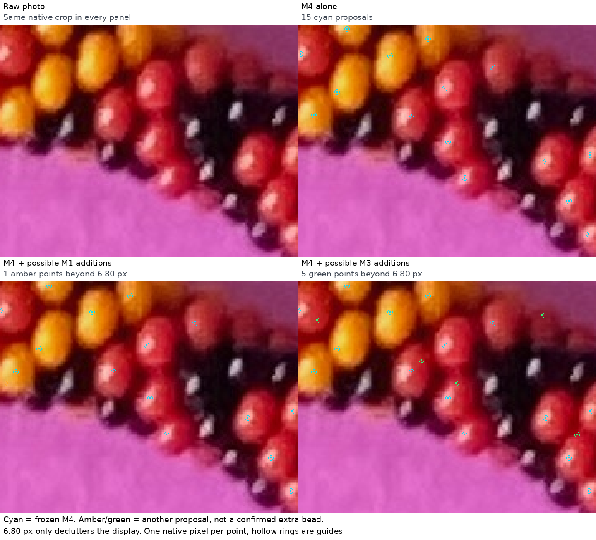
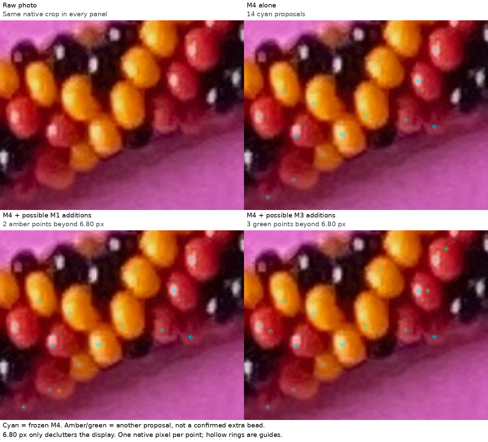
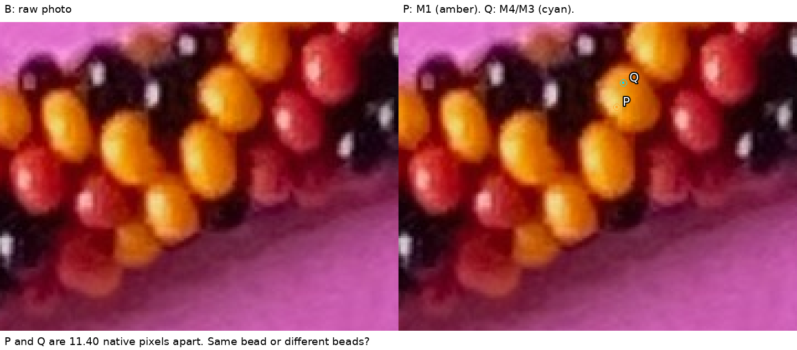

# Maker's seed review and possible supplements — R232

Your A/B assessment makes **M4 the provisional starting point**. M1 and M3 have
useful evidence worth checking alongside it. The old seeds and M2 are unsuitable
as direct trusted seeds. This is my interpretation of your review; no production
method has been selected or changed.

Open **http://127.0.0.1:4001/seed-review.html** with your existing server still
running. This new [self-contained page](review/r232/index.html) contains the
comparisons and the small question below. Your original `/seed-methods.html`
continues to show exactly the reviewed R231 proposals.

| Method | Your assessment in A | Your assessment in B |
|---|---|---|
| Old | Bad | Very bad |
| M1 | Okay, misses some | Okay, misses some beads |
| M2 | Bad, some correct and some wrong | Unwanted double hits and a hit over nothing |
| M3 | Not great, avoids yellow | Pretty good, misses some beads |
| M4 | Pretty good | Pretty good, misses a different set |

[Your exact wording and the frozen images it reviews](seed-method-answer-r232.json)
are preserved. This answers Q231.1 qualitatively. It does not confirm every point
or the exact green disk P from Q231.2; that containment question remains open.

M1's intended target needs clarification: it finds **bright diffuse colored
interiors**, rather than specular reflections. The code replaces previously
detected reflections with a local median before measuring brightness and excludes
those pixels as seeds. Undetected highlights can still affect it. The reflection
detector and its separate evidence remain unchanged.

## Three options to inspect

1. M4 alone: keep its profile-supported points as the starting proposal set.
2. M4 with M1 supplements: inspect brightness points where M4 is absent or shifted.
3. M4 with M3 supplements: inspect tested interior patches where M4 is absent or shifted.

These are diagnostic comparisons, not three accepted bead inventories. For a
readable picture, show extra M1/M3 points only when their nearest same-family M4
point is at least **6.80 native pixels** away. Search the full photo, including
points outside the crop. This quarter-diameter distance only reduces clutter;
it cannot tell whether two points belong to different beads. No points are moved,
merged or promoted, and the detector is not rerun.

Each mark colors one original photo pixel. Hollow rings locate that pixel; they
are not bead edges. Cyan is M4, amber is a possible M1 supplement, green is a
possible M3 supplement. The raw photo is beside each comparison.





## Which operation removed the other proposals?

The archived M4 measurements distinguish profile rejection from spacing removal.
For each exact M1/M3 coordinate, look up its original profile-pool entry. Check
the saved counts of successful cuts in horizontal, diagonal, vertical and
opposite-diagonal directions. At least two cuts must pass in each of two
perpendicular directions. After that, M4 keeps higher-scoring points first and
removes another point of the same color family within 13.60 pixels.

| Crop / source | Total proposals | Exact coordinates kept in M4 | Pass profiles, removed by spacing | Fail profiles |
|---|---:|---:|---:|---:|
| A / M1 | 11 | 3 | 7 | 1 |
| A / M3 | 8 | 0 | 2 | 6 |
| B / M1 | 11 | 6 | 5 | 0 |
| B / M3 | 12 | 3 | 7 | 2 |

Every M1 point in B passed M4's profile test. Five were replaced by higher-scoring
nearby proposals during spacing. This tells us where to investigate a difference;
it does not prove that those five points represent already covered beads. M3's
differences have both causes: profile rejection and spacing removal.

Proximity is especially weak as a bead counter. In B, M3 has 3 points at least
6.80 pixels from M4, but none at least 13.60 pixels away. Across the photo these
counts are 290 and 101 respectively. These are **point distances**, not counts of
missed beads. Simply combining lists could add several locations in one bead.

## One small ownership question

Here is one easy yellow area in B, with the raw context preserved. Amber P is
M1:53 at (943,388). Cyan Q is M4:55 at (946,377); M3:45 uses that exact same Q
coordinate. Their separation is 11.40 pixels. Both candidates passed the M4
profile rule; Q scored 0.1613 and P 0.0790, so spacing removed P.



**Q232.1:** Are P and Q inside the same yellow bead, or two different yellow beads?

The [as-issued image hash, native coordinates and question](review/r232/question.json)
are preserved. A same-bead answer would establish one example of a point shift;
a different-bead answer would establish one example of spacing dropping a useful
neighbor. Either answer concerns this pair only. No ownership conclusion follows
yet, and neither answer establishes a visible center or confirms new mask pixels.

## Reproduction and stopping point

```bash
.venv/bin/python photo2/review_seed_complementarity.py
```

This reads the frozen R231 point lists and profile archive; it verifies their
hashes before drawing. It does not run extraction, read manual bead labels or
series, grow regions, or fit geometry. If the ignored profile archive is missing,
restore the exact R231 archive before running this diagnostic; the prior
[experiment](SEED_METHOD_COMPARISON.md) documents its generation.

[Measurements and thresholds](review/r232/analysis.json),
[input/output seals](review/r232/summary.json) and
[verification](review/r232/verification.json) preserve the measurement trail.
The old synthetic scenes still do not reproduce the photo seed failures; no
unchanged detector tests were repeated and no photo accuracy or completeness is
claimed. The static page needs no JavaScript; browser rendering has not been
tested in a real browser here.

Stop at preserving your review and diagnosing complementarity. Next resolve the
illustrated P/Q relationship, then choose how to supplement M4 without duplicate
points. Use gpt-6.1-sol / High in this conversation; no `/new` needed.
