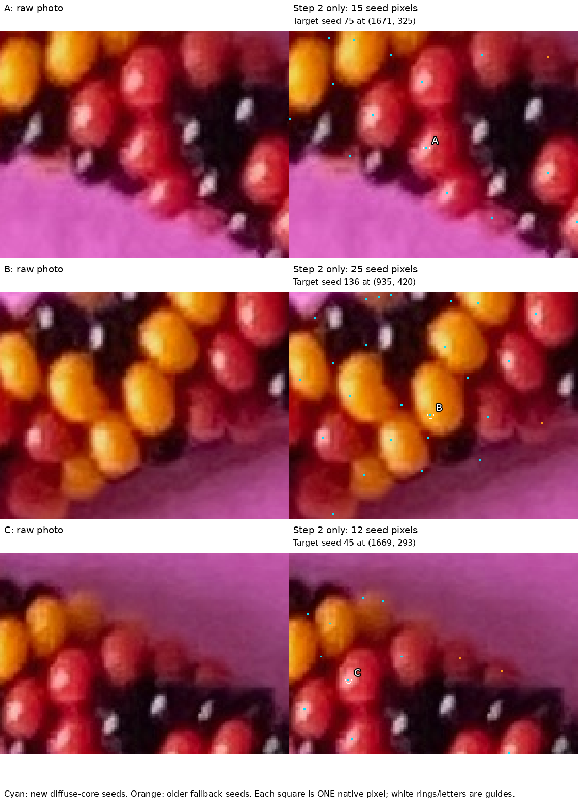

# Step 2 alone: single-pixel starting points — R229

Step 2 returns **one seed position per proposal**, before any region growth.
My earlier description of its output as small interior patches was inaccurate:
neighborhoods help choose the position, but the output is a single marked pixel.
The large filled masks in the earlier viewer start at step 3.

With your existing HTTP server still running, open
**http://127.0.0.1:4001/step2.html**. No server restart is needed. This is a
separate page; the original root page still shows the later stages.
Alternatively, open the [self-contained point viewer](review/r229/index.html).
Choose A, B, C or Whole necklace, zoom, and scroll to pan. Click near a point
to read its seed number and native coordinate.



Raw photographs are on the left. On the right, each cyan or orange square
occupies **one original photo pixel**, enlarged together with the photograph.
Cyan marks new diffuse-core seeds; orange marks older automatic fallback seeds.
White rings and A/B/C letters are location guides, not selected pixels.
The crops contain 15, 25 and 12 seeds respectively. The marked A, B and C are
the starting points for the same earlier automatic examples; they are not your
manual bead numbers.

There are **1,566 pre-growth seeds** across the photo: 1,515 new and 51 fallback.
All 279 seeds excluded by later region filters remain visible here. A seed is
a proposed starting position, not a confirmed bead, unique bead identity or
measured center of its visible part. A colored point can still be misplaced.

[Whole-necklace raw/point comparison](review/r229/whole-seeds.png) uses enlarged
hollow rings so the locations can be seen at that scale. In the viewer,
“Enlarge location guides” controls these rings separately from the actual
one-pixel markers. The rings add no selected pixels.

## Q229.1 — one simple seed check

In the **A close-up**, is any cyan seed clearly on paper or a black bead rather
than inside a red or yellow bead? If so, click near it in the point viewer and
give its seed number or describe its position. “None obvious” is also useful.
This asks about obvious seed mistakes in one crop, not confirmation of every
seed or bead ownership elsewhere. [As-issued image and native points](step2-seed-questions-r229.json).
The question is pending.

## Provenance and stopping point

The presentation recovers the full seed list from the frozen R218 records and
later exclusions, and checks every integer position against the saved marker
matrix captured before the R224 watershed. It does not rerun or change the
extractor. Diagnostic crops are selected after extraction, solely for display.
Sources and image payloads are sealed in the [summary](review/r229/summary.json);
the [point ledger](review/r229/seeds.json) preserves original seed coordinates,
their integer marker pixels and source descriptions.
The [verification record](review/r229/verification.json) checks all native marker
positions, the embedded source photograph, exact one-pixel SVG rectangles,
earlier sealed payloads and JavaScript syntax. Browser painting and control
interactions were not exercised by those checks.

```sh
.venv/bin/python photo2/review_step2_seeds.py
```

The native one-pixel label map is saved under the ignored output directory at
`photo2/output/r229/seed-labels.tiff`. Segmentation rules, grown masks, reflections,
manual annotations and geometry remain unchanged. Stop at showing step 2.
Next review seed quality with the maker before returning to growth and trimming
diagnosis. Recommend gpt-6.1-sol / High; stay in this conversation, no `/new`.
