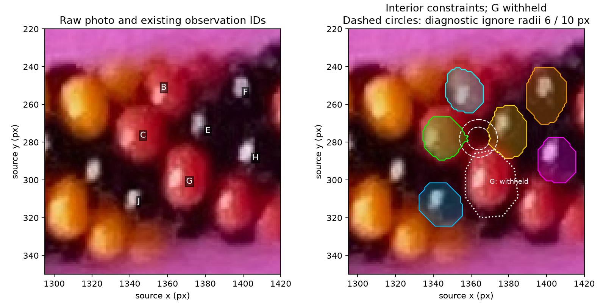
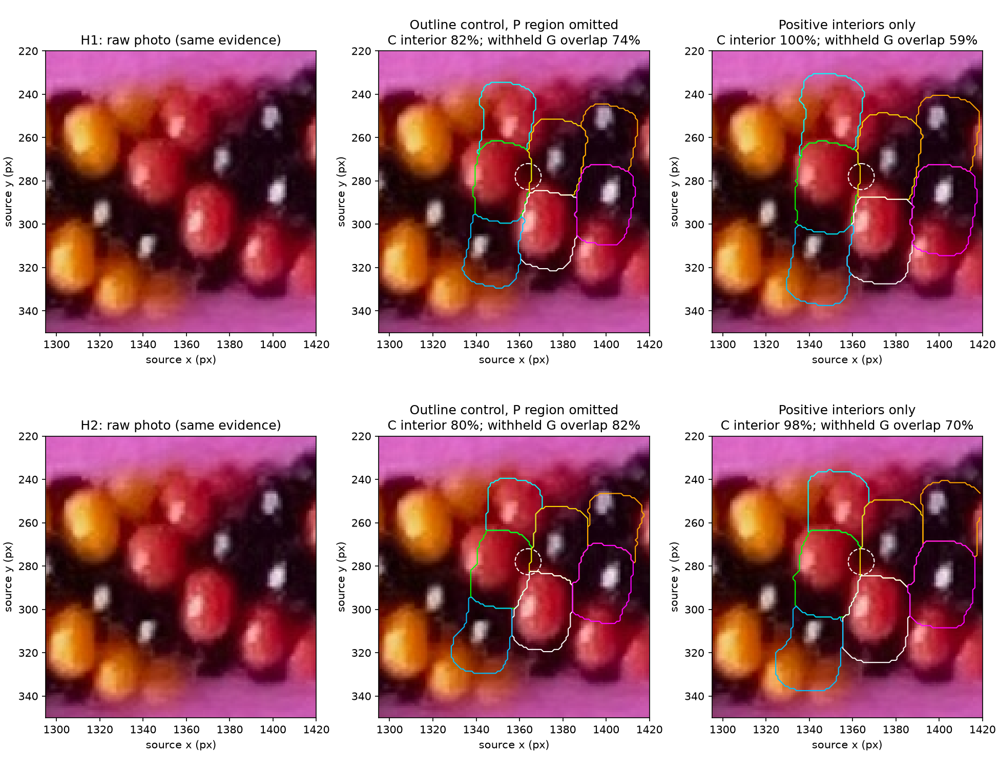

# Clear-surface constraint comparison — R132

**Later R135–R136:** [boundary brackets and maker neighbor review](BOUNDARY_ARC_FIT.md)
complete the next comparison. Q132.1 is answered with coupled BC/CG families 6/7
or 7/6, signs unresolved; both old charts used BC=1 and are superseded as active
photo mappings. Numerical reports and the historical status below remain frozen.

**Completed to review:** positive interiors improve core coverage but permit
oversized visible regions and worsen the withheld prediction. Do not adopt
interiors-only fitting as a replacement or select a neighbor chart from it.
Keep the unknown-region handling. This remains stage 1, local geometry and
neighbors, in [PLAN.md](../PLAN.md); no ring expansion or index recovery occurred.

The preceding fit missed clear surface on C and F. R130–R131 place P in a shadowed
junction and tentatively outside a bead near an edge, without an exact boundary.
We compare whether negative penalties outside rough polygons caused the mismatch.

Three methods were presented: omit P's neighborhood but retain outline fitting;
fit only supported interiors; or fit selected clear boundary arcs. The first two
are the current controlled comparison. Geometry, tentative charts and nominal
perspective calibration stay fixed in form; camera/phase/scale can be refitted.



The cores come from eroding the existing assistant polygons by 3 or 5 pixels.
Circles of radius 6 or 10 pixels around P are diagnostic exclusions, not
maker-supplied boundaries. Unknown pixels have no positive or negative ownership
penalty and cannot create an artificial boundary in the distance transforms.
G remains withheld. Exterior pixels are unconstrained in the interiors-only test;
area and held-out overlap checks are essential to detect oversized predictions.

The current run includes a known POV synthetic example and the photo, both
candidate charts, a masked-outline control and interior-only sensitivity variants.
Results below use independent POV-Ray masks and a common evaluation support.

## Measurement and fitting details

This is an assisted diagnostic. No new body, pigment, index or automatic image
selector is introduced. The existing seven IDs and rough polygons are reused;
A/D/I/K/L remain outside the active fit and all twelve original observations remain
recorded. Black bead interiors still participate. The maker's picture counts are
review evidence, not fixed runtime color or count priors.

The photometric inputs here are the supplied region proposals, not sampled RGB
values. Cores shrink those regions inward, avoiding uncertain boundaries. An
existing highlight may lie inside a supported core, but is never used as a
boundary or outward-point marker. [Displayed support](review/r132/surface-evidence.png)
shows the raw context, cores, omitted junction and withheld G before measurements.

In the control, penalties for missing interior or spilling outside a polygon
remain, except in the omitted circle. In the positive-core method, a penalty is
paid only when a supported training-core pixel is not owned by its assigned model
bead. Occlusion enforces one visible owner per ray. Pixels outside all training
cores do not constrain ownership. Per-body normalization prevents larger regions
from dominating. Unknown pixels are removed from both penalties and distance-
transform boundaries; changing their labels cannot change the objective.

Geometry stays the original rounded annular bead on the calibrated straight
planar section, with the same latent occluders and proposed H1/H2 assignments.
The photo uses the previous nominal perspective calibration and provisional
image-center principal point. The 55-degree local camera/phase gauge remains a
coordinate convention, not a measured elevation. Two deterministic local starts
per case refit translation, scale, roll, azimuth and phase with the same bounded
Powell search: two-pixel then one-pixel spacing, at most 400 evaluations per stage.
A worse final line-search value is not substituted for a better starting value.
This is not a global-optimum claim.

There are four known-synthetic cases and eight photo cases. Both charts compare
the outline control and positive cores at erosion3/radius6. Photo sensitivities
also use erosion3/radius10 and erosion5/radius6. All final evaluations use the
same erosion3/radius6 support, including G, so shrinking a training core does not
silently make the reported evaluation easier. The synthetic omitted circle
simulates missing evidence at the same pixel coordinates; it does not identify
a physical counterpart of P in the synthetic scene.

The original POV macro generates the known synthetic regions independently;
source pose/index truth is evaluator data. Initialization comes from the frozen
prior fitted candidates, which excluded G. New training data also exclude G.
Correct and wrong charts are both retained in the comparison. Final candidate
masks are rendered independently by POV-Ray; Python ray ownership is checked
against them before measurements. Ordinary generated scenes/logs stay ignored.

## Results and decision



For the nominal comparison, both methods omit a six-pixel circle about P and use
three-pixel interior erosion. These figures describe the same evaluation support:

| Photo chart / method | C core covered | F core covered | C area / rough observed area | Withheld G overlap |
| --- | --- | --- | --- | --- |
| H1 outline control | 81.7% | 85.0% | 1.26 | 73.9% |
| H1 interiors only | 100.0% | 95.7% | 1.67 | 59.2% |
| H2 outline control | 79.9% | 72.7% | 1.22 | 82.4% |
| H2 interiors only | 97.7% | 85.7% | 1.60 | 69.8% |

Overlap is intersection divided by union against an assistant polygon with the
unknown circle removed, not an accuracy probability. The polygons themselves
remain uncertain; area growth is a diagnostic warning, not a verified physical
size error. The raw panels also show the enlarged predictions. Simply omitting
P from the old outline objective did not resolve C/F's mismatch.

The radius10 and erosion5 sensitivity fits retain the same problem: C's predicted
area is 1.52–1.65 times its rough observed area, and withheld G overlap is
60.1–73.7%, below the corresponding outline controls. Mean training-core coverage
rises, but does not validate those full visible outlines.

On known synthetic geometry, the correct chart's outline control covers every
training core and predicts G with 95.6% overlap; the wrong chart gives 83.9%.
With interiors only, both charts cover almost all training cores: 100% for the
correct chart and 99.92% for the wrong one. Withheld G overlap becomes 87.9% versus
90.4%, favoring the wrong chart in that single held-out measure. Thus interior
coverage alone is weak evidence for a correspondence graph, even in the known
example. No general recovery rate or automatic detector is demonstrated.

All twelve candidate renders pass independent POV ownership comparison: at most
12 differing pixels out of 16,250 (0.074%). Final metrics use the POV masks.
Three targeted tests pass: unknown labels/ownership cannot change constraints
or scores; G and unassigned pixels do not receive core penalties; tracing only
supported rays preserves the full-grid core score. Numerical optimization hit
its evaluation cap in nine of 48 stages, across five interior-only photo cases;
those events are retained. The observed failures do not prove that every possible
interior-only optimum must be poor, nor identify geometry versus correspondence
as the sole remaining cause.

**Decision:** preserve explicit unknown pixels, but reject interiors-only fitting
as the replacement based on this comparison. Both H1/H2 remain tentative. Next
bounded task: use selected clear boundary arcs to constrain size/shape together
with interior support, retaining the unknown junction and held-out G. Review
Q132.1 first if an answer arrives; it may change the shared direction-1 premise.
Stop here before implementing that next test or expanding the necklace graph.
Recommend gpt-6-astra / High; stay in this session, no /new required.

[Full parameters, metrics, optimizer outcomes and source hashes](review/r132/report.json)
and [compact comparison](review/r132/summary.json). The run was interrupted during
execution-environment refresh; three completed synthetic cases were reused after
dependency validation. Per-case executed-code hashes distinguish those cases from
the later checkpoint-capable wrapper. No numerical kernel changed in that resume.

## Question and next-step decision

[Q132.1](SURFACE_CONSTRAINT_QUESTIONS.md) checks a different point from Q126.1:
whether B and C are immediate direction-1 neighbors, or another family/unclear.
Both current charts assume direction1 with opposite signs. A family confirmation
alone cannot select H1 versus H2; a contrary answer would challenge both charts.
P's reviewed uncertainty remains preserved and is not being asked again.

## Reproduce

```sh
.venv/bin/python photo2/refine_surface_constraints.py
.venv/bin/python photo2/review_surface_constraints.py
.venv/bin/python -m unittest discover -s photo2 -p test_surface_constraints.py -v
```

The fitting command regenerates the known POV example and all twelve cases from
tracked inputs. `--resume` can reuse complete cases after dependency-hash checks;
individual cases retain the executed fitter's source hash. The renderer helpers
and R126 reports remain unchanged. No packages were installed.
