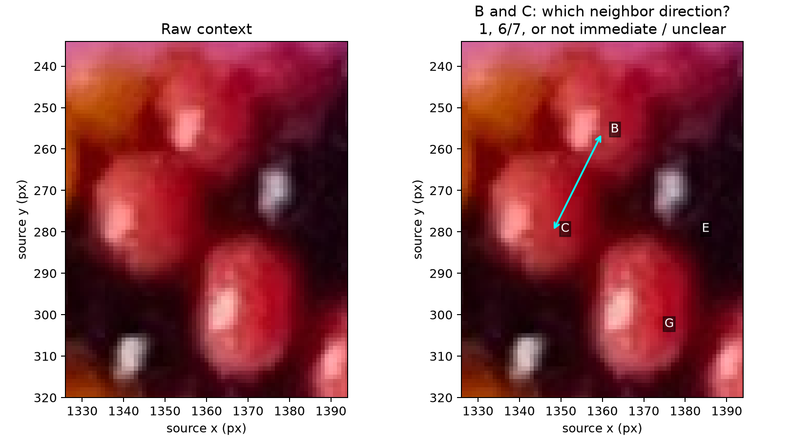

# Surface-constraint review question — R132

## Q132.1 — Neighbor direction between B and C

Are B and C immediate neighbors in direction 1 (around the rope's small
circumference), in direction 6 or 7, or not immediate neighbors/unclear?
The two-ended arrow connects the existing interior observations; it does not
claim a center, boundary, sign or index. Both current candidate charts assume
this pair is direction 1, with opposite signs. Confirming the family alone would
not choose between them; a different answer would challenge their shared premise.

**Status: pending.** Asked during the R132 constraint comparison. An unclear
answer is acceptable and does not prevent independent numerical checks.
Q126.1 about P is already answered and is not being reopened.

For the current problem and its place in the overall solution, start with
[PLAN.md](../PLAN.md). [Experiment details](SURFACE_CONSTRAINTS.md).
