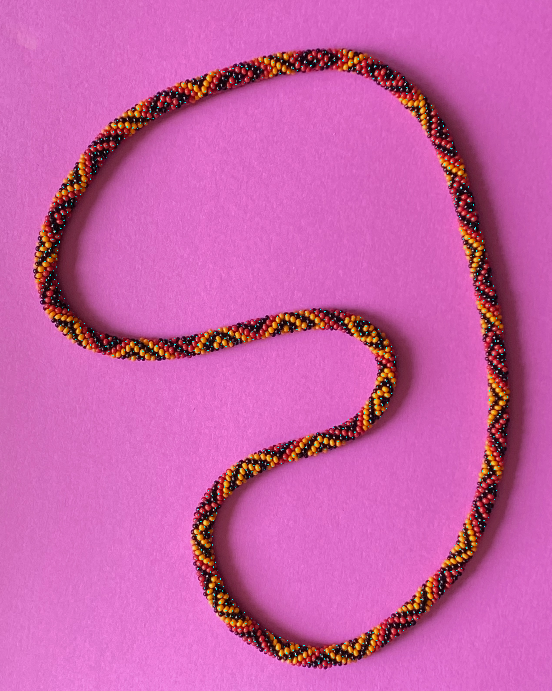
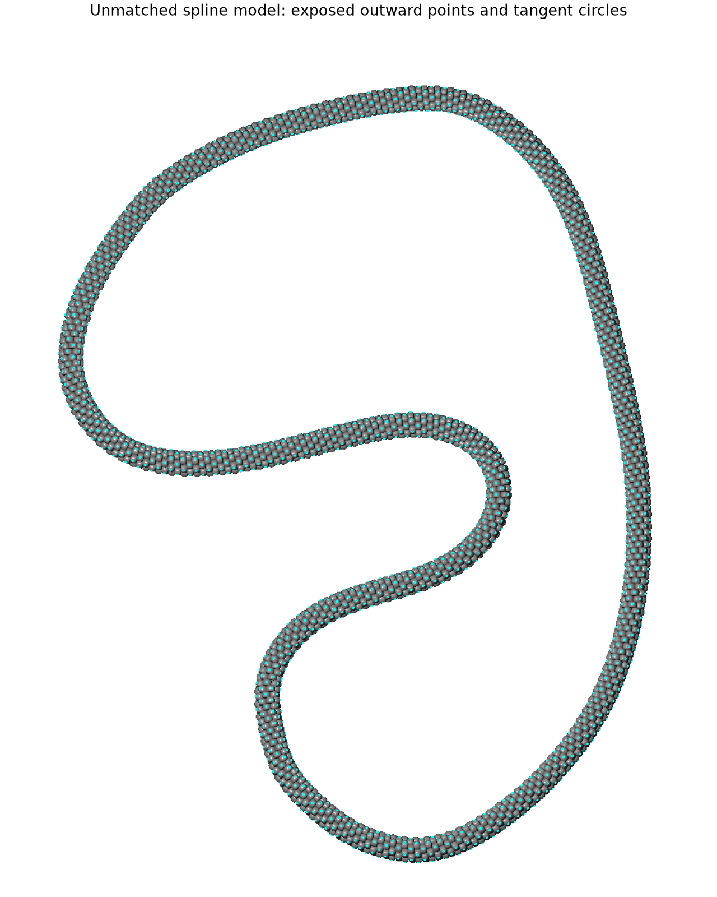
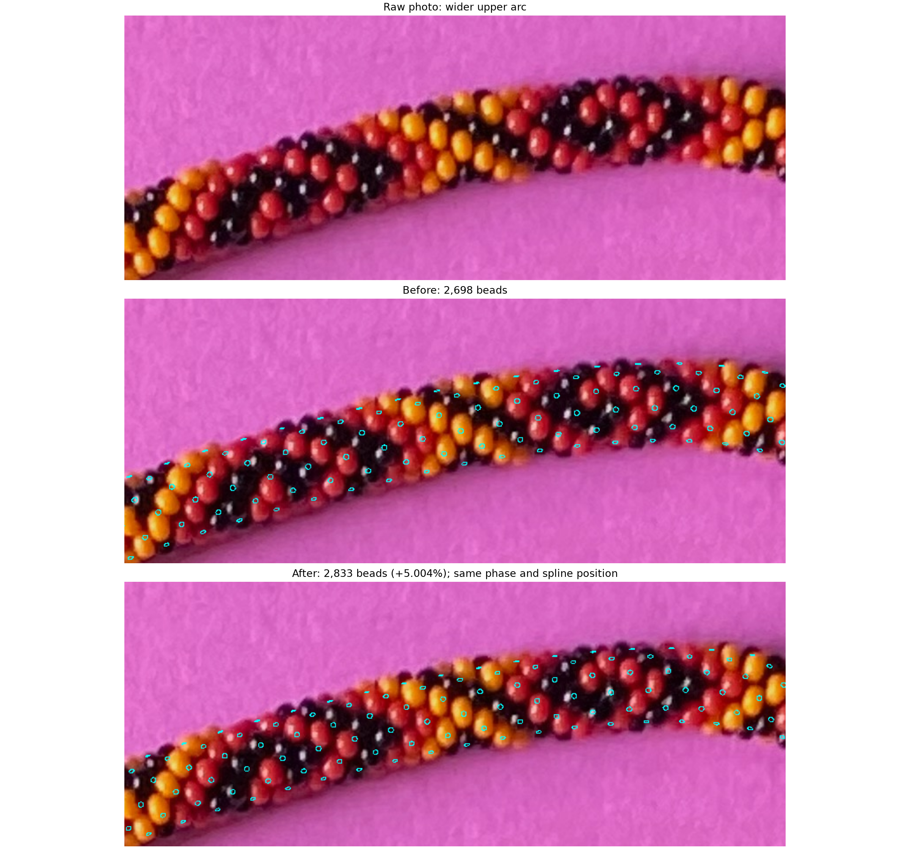

# Minor-outward tangent circles — R175–R178

**R179:** [Both helicities at original and +5% counts](HELICITY_COUNT_COMPARISON.md)
provides four whole-photo overlays and matching local/wider comparisons.
**R181–R182:** [Interactive viewer](TANGENT_VIEWER.md) adds a count slider,
helicity control, zoom/pan and saved choices. [R180 feedback](drift-review-r180.json)
records similar drift for both hands; the best count remains unresolved.

The Python prototype constructs the entire bracelet on a planar centerline,
finds each bead's minor-outward point and tangent plane, and projects a small
cyan circle there. **A circle is drawn only when its center point is exposed
in the model.** Another visible part of the bead does not qualify it (R176).

R177 increases the initial count from **2,698 to 2,833**, a rounded **5.004%**
increase. R178 requests the whole-image overlay; the saved image preserves all
2540 × 3182 EXIF-oriented source pixels. Phase, along-spline origin, camera,
hand and physical bead dimensions are unchanged for this comparison.



[Full-resolution overlay](review/r177/bracelet-overlay.png),
[raw/local overlay](review/r177/patch-overlay.png),
[before-and-after upper arc](review/r177/spacing-comparison.png),
[adjustable current parameters](review/r177/parameters.json),
[frozen measurements and provenance](review/r175/summary.json).

## Existing spline and initial count

There is a historical approximate centerline, preserved as
[spline-seed-r175.json](spline-seed-r175.json): 303 source-coordinate points from
`photo2/centerline.json` at historical commit `2c4c116`. A periodic cubic spline
uses a 2-pixel RMS smoothing budget. This is an assisted diagnostic seed, not a
newly validated physical centerline or an automatic runtime locator.

The historical local analysis proposed 2,698 beads (415 turns). Its compact
[count provenance](count-seed-r175.json) is preserved. That count was
not established by closure. Its source hash is saved in the summary; none of
its old bead dimensions or color hypotheses is adopted. The user-requested
2,833-bead version has 436 turns and 6.497706 beads per turn. Both counts are
adjustable hypotheses, not recovered totals.

Four approaches were considered before implementation: a circular torus for a
geometry check; reuse of the existing planar spline; a new image-derived strip
spline; and a local straight-patch model. Reusing the saved spline gives the
requested whole-bracelet prototype now. The circular limit supplies a separate
geometry test. New automatic spline extraction is a later aspect.

## Geometry and exposure

Use the literal placement and rounded-annular bead dimensions in `beads.pov`,
including its radians interpretation of `sin(180/6.5)`. The bead outer radius
is 2.11091575 model units; the minor-circle radius is 4. Each bead's axis follows
the spline tangent, its phase advances around the minor circle, and its station
advances uniformly in world arclength. Integer turns close the model.

Let C be the local centerline point, u the unit minor-radial direction and R
the bead radius. The selected outer-wall midpoint is **P = C + (4 + R)u**.
It is the maximum minor-radial extent, distinct from a visible-area centroid,
highlight, or the major-circle outside boundary. The tangent plane is
**u · (X − P) = 0**. A circle of radius 0.18R uses orthonormal directions T
(the local tangent) and u × T within that plane. Projection turns it into an
ellipse. These are small markers, not inferred bead outlines.

All beads, including hidden ones, participate in the occlusion calculation.
Ray marching through the actual rounded-annular surface must find this bead
first and reach P's depth within 0.002 model units. Unfinished rays are excluded.
A normal-to-camera dot product greater than 0.12 removes grazing edge anchors.
March tolerance is 0.00001 units, with at most 600 iterations per candidate.
This estimates exposure in the provisional model; actual photo exposure is
not established until the shape/camera/correspondence fit improves.

The initial unmatched model is generated before registration:



The model's scale follows from fixed bead dimensions and the spline's world
length. Increasing N on the same projected spline reduces station spacing by
4.765% and projected bead size by 4.817%; physical dimensions stay fixed.

## Small assisted registration and count comparison

Only confirmed yellow interiors 8 and 11 and red interior 20 fit the initial
phase and spline origin. Positive interior loops supply admissible locations;
their centroids initialize proposals, without becoming measured outward points.
Both index charts and both hands are evaluated at guessed camera elevations
65°, 80° and 89°, with eight phase starts: 96 candidates. No black point or
held group 22/23/24/25 participates in fitting or ranking.

The initial selected proposal is chart B, hand −1, elevation 89°, phase
−21.979857° and spline origin fraction 0.80164617. Its three predicted points
are exposed and inside the confirmed colored cores. **Chart A / hand +1 also
fits all three cores.** The small centroid residual difference does not settle
helicity; the camera elevation is a fitting guess, not a measurement.
[All candidate results](review/r175/fit-candidates.json) remain available.

The count change is a separate overlay, with no refit. This preserves a clean
comparison: 1,246 anchors are drawn before, 1,307 afterward. The new predicted
point on 8 moves outside its conservative positive core; that core is not a
full silhouette, so this alone does not reject body ownership. Predicted point
17 lies in its confirmed black core without being used in the fit. Predicted
14 lies outside its small reflection-centered core in both versions; the maker
already explained why that reflection is off-center. None of these checks
establishes the true outward point.



**Q177.1:** In this wider upper-arc comparison, does the spacing of the cyan
circles look closer to the photographed bead spacing after increasing the
count to 2,833? R180 supplies a qualitative answer: drift to boundaries occurs
after130–156 bead steps at2698 and65–91 at the increased count, similarly for
both hands. The correct count remains unresolved. This asks about spacing,
not whether every circle has the correct bead identity.

## Run and adjust

Use Python 3.12 in the project's existing environment:

```bash
.venv/bin/python photo2/tangent_circles.py --stage model --output photo2/output/r175/model
.venv/bin/python photo2/tangent_circles.py --stage fit --output photo2/output/r175/fit
.venv/bin/python photo2/check_tangent_circles.py
.venv/bin/python photo2/tangent_circles.py --stage overlay --parameters photo2/output/r175/fit/parameters.json --nbeads 2833 --output photo2/output/r177/count-plus-5-percent
.venv/bin/python photo2/check_tangent_circles.py --parameters photo2/output/r177/count-plus-5-percent/parameters.json --output photo2/output/r177/count-check
.venv/bin/python photo2/review_tangent_circles.py
```

To recreate the current whole-photo overlay directly from tracked parameters:

```bash
.venv/bin/python photo2/tangent_circles.py --stage overlay --parameters photo2/review/r177/parameters.json --output photo2/output/tangent-current
```

For a small phase/station adjustment in a fresh output directory:

```bash
.venv/bin/python photo2/tangent_circles.py --stage overlay --parameters photo2/review/r177/parameters.json --phase -20.979857 --origin-shift-px 1 --output photo2/output/tangent-adjusted
```

`--phase` is absolute degrees; `--origin-shift-px` advances by nominal pixels
in the inverse-projected spline plane, not exact image arclength when oblique.
`--nbeads`, `--hand`, `--elevation` and `--circle-radius` are also adjustable.
Use `overlay` for controlled edits; `fit` performs a new multistart registration.
The saved JSON can be edited too. These commands do not touch maker annotations.

Each stage saves its parameters and hashes. `geometry.npz` holds every generator
index, centerline station, bead center, outward point, tangent circle, projected
point and exposure mask. The tangent-plane normal is `radial` and its offset
is `tangent_plane_offset`; `normal` denotes the planar left normal. Generator
indices are not inferred photo bead indices. Curated figures/parameters are
tracked; routine geometry, ray scenes and renders stay ignored.

## Validation and stopping point

Four tests check the exact circular placement for both hands, tangent-plane
coplanarity/circle radius, actual surface normals, and hidden-point suppression.
Independent POV-Ray renders use the source bead macro and encoded body IDs.
At exactly matching pixel rays, Python and POV-Ray agree on 2,698 unmatched,
2,694 registered and 2,828 count-adjusted rays: zero mismatches. Four and five
registered/count-adjusted rays respectively remain unverified. Rounding an
exposed mathematical anchor to a preview pixel can move the ray across an edge;
that separate finite-pixel check is retained, not conflated with exact-ray parity.

Stopping point: working adjustable forward model, three-colored-core initial
registration, requested +5% overlay, and whole original photo. Next bounded
task: use the spacing review and an adjacent unfitted colored patch to refine
phase/station/count or spline, preserving both charts. No total count, whole
matching or helicity claim. Recommend **gpt-6.1-sol / High**, same session;
no `/new` needed.
