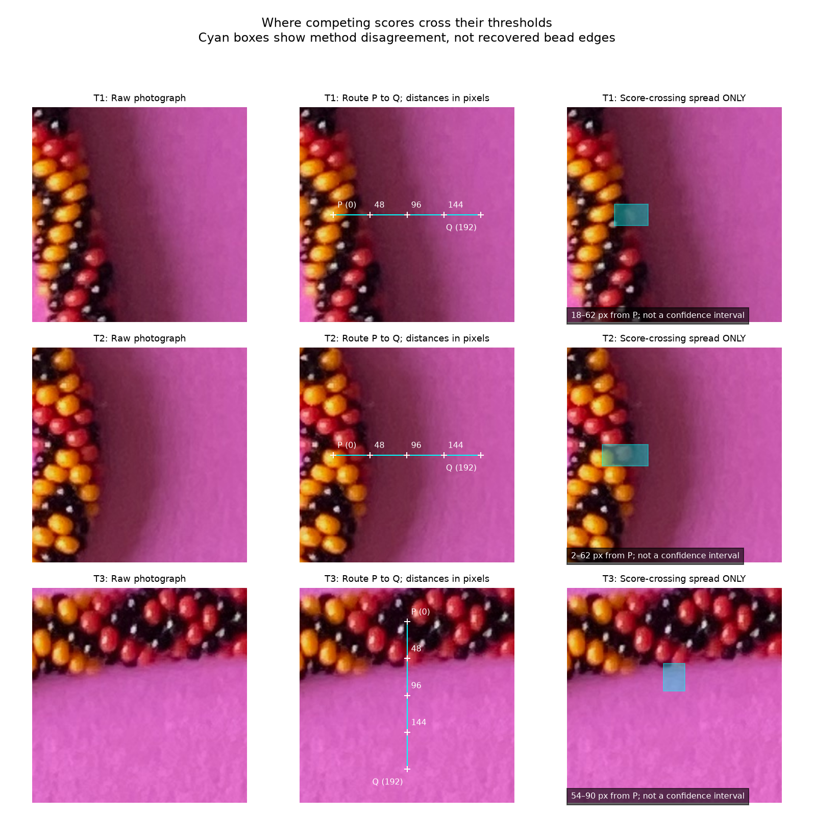

# Two visual questions — no need to catch up on the older questions

R099, pending. The cyan boxes show where several automatic scores change; they
are **not accepted bead boundaries**. Paper in shadow counts as background.
The middle column shows where each measurement travels; numbers are pixels
from P. The first column stays unmarked for comparison.

1. **T1 and T2:** does each cyan box cover the actual bead-to-paper edge, or is it
   mostly too far into the beads or the paper? A rough answer for each row is enough;
   “unclear” is useful too. We want to avoid the false indents and bumps you noted.
2. **T3:** where along P→Q would you place the last bead edge—before 48, around 48,
   between 48 and 96, or unclear? The smallest window sometimes loses the dark
   bead signal before it reaches paper. Please also flag P if it looks like a
   bead boundary rather than a usable dark interior.

Larger walkthroughs: [T1](review/r099/T1.png), [T2](review/r099/T2.png),
[T3](review/r099/T3.png). [Findings in plain language](BACKGROUND_TRANSITIONS.md).
No precise pixel annotation is required. No answers have been supplied.
The [earlier Gaussian-radius question](QUESTIONS.md) remains optional; its
unanswered status did not block this explicitly parameterized comparison.
