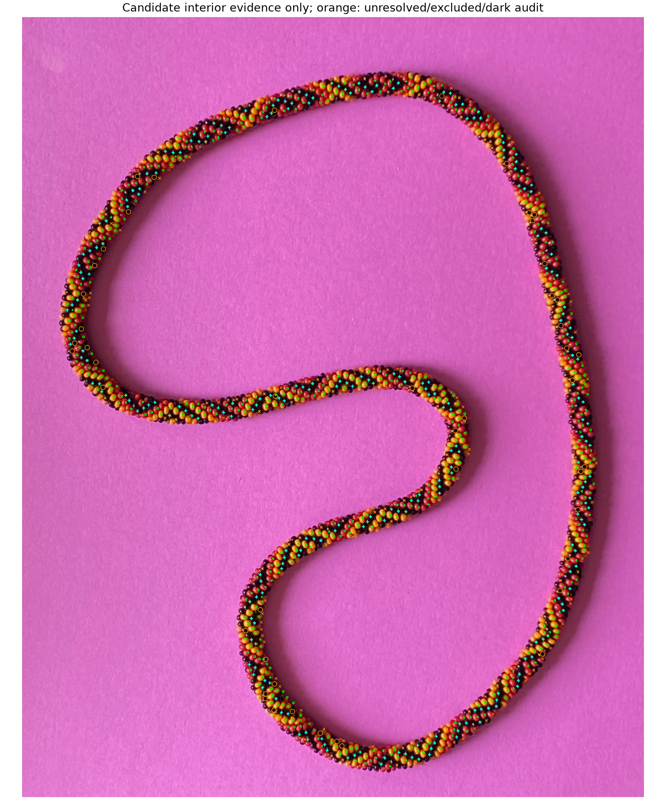
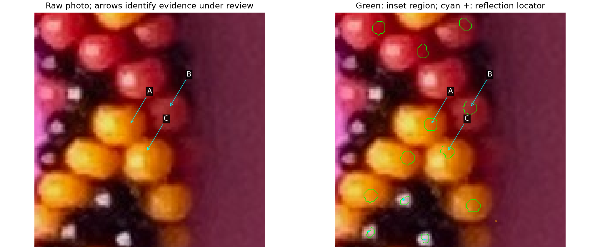
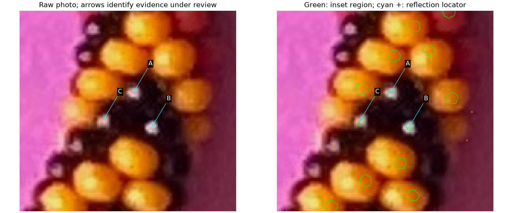

# Build the trusted image evidence first — R192

The maker redirects the work: establish positive interiors of every
distinguishable central red/yellow bead and identify black bodies with their
reflection positions **before fitting simulated positions**. Ambiguous edge
slivers can be excluded. This supersedes the next centerline/geometry fit.

**R193 update:** the maker answers both illustrated questions yes. The
[current ledger and ownership audit](BEAD_OWNERSHIP_AUDIT.md) add the six exact
pictured regions and three black-reflection locator ownership facts. The R192
ledgers/pictures below remain frozen; their proposal totals are historical.

**We cannot yet claim every eligible bead is reliably identified.** The old
point inventory was a proposal set, and the new region audit still has ownership
errors, misses and duplicates on known examples. We now preserve trusted facts
separately from all automatic candidates, rather than calling threshold outputs
trusted. No photo-to-model fit, spline change or stretch is performed here.

## Trusted facts and candidate evidence

[Trusted-fact ledger](review/r192/trusted-facts.json) preserves five maker-confirmed
positive regions: yellow 8/11, black 14/17, red 20. It also preserves confirmed
black-reflection point ownership on 10/14/17, the confirmed point on 16, the
three distinct bodies from R168 and the consecutive diagonal from R189. These
are different kinds of evidence; point ownership does not confirm new region
pixels. Existing facts do not establish full-body extents or centers.

Two new patches are wholly contained in those previously confirmed interiors:
observation 939 in yellow bead 11 and observation 943 in black bead 17.
Their recorded pixels and loop vertices inherit that existing support; these
are smaller subsets of known bodies, not two newly discovered beads. Partial
overlap on beads 8/14/20 does not certify their new whole patches.

[Candidate ledger](review/r192/candidates.json) stores native integer pixels as
row runs, closed interior routes, appearance/support measurements, reflection
locations, threshold sensitivity and stable observation IDs. Its numbers are
observation names, not bead_index. There are **512 colored-region proposals and
236 black/reflection-region proposals**. Another **20 black reflection proposals
have no accepted small region**, four observations have unresolved extraction,
and 221 are excluded by the provisional edge guard. Retain every status.

The native search adds 35 colored seeds not associated with the old detector's
points. Another 47 unassociated dark areas need review: some can be missing
black bodies, but seams and shadows can also pass that test. They are not 47
black beads. Candidate counts are not unique-body counts or coverage guarantees.



Green loops are small interior proposals, not bead boundaries. Cyan crosses
locate bright reflections. Orange crosses/circles mark unresolved or excluded
observations and dark-area audit locations. Full raw/proposal tile review is at
`photo2/output/r192/atlas/index.html`; click a tile to enlarge it. The
[tile coverage record](review/r192/coverage-tiles.json) accounts for every
observation once by seed location, including failures. Padding provides context.
The atlas is routine output, reproducible from the commands below.

## Methods and this bounded implementation

Four methods were presented: local color/S/V regions, watershed separation at
dark seams, reflection-plus-dark-surround evidence, and raw tiled coverage
review. Select local conservative regions and black context with the tile
audit. The unchanged coarse image detector proposes seeds; an independent
native-pixel search checks for additional substantial colored and dark areas.
No old spline, maker coordinates, saved hue boxes or simulated bead positions
enter these decisions. The learned appearance modes are named yellow/red only
after selection, by comparison with existing maker-confirmed color facts.

For colored seeds, use learned circular hue, local saturation and value floors,
and a local-value comparison to reject dark seams. Restrict the neighborhood
by both image-derived apparent scale and nearby competing seeds. Keep only a
nearby connected component, shrink by distance to rejected appearance pixels,
and cap the final positive patch at a small fraction of apparent bead diameter.
No unknown holes are filled. A region needs at least 12 native pixels.
The support margin is not a certified distance to the true bead boundary.

For black proposals, refine the accepted bright feature at native resolution
and record its weighted brightness centroid separately. Require dark surround
evidence; hue is not used to declare black membership. The final loop is a
small local subset near that feature, not the inferred outline of a dark body.
If the small region fails, preserve the reflection and its dark context as a
reflection-only proposal. Changing the brightness threshold provides a position
sensitivity check, not a physical or lighting calibration.

The initial broader black cores crossed adjacent bodies in 9–11 of roughly 97
regions on known renders. [Frozen adverse examples](review/r192/broad-region-failure.json)
preserve this failure. Smaller patches reduce but do not eliminate these errors:

| Known appearance-only fixture | Region proposals | Single-body regions | Mixed/background | Duplicate body regions | Eligible bodies located |
| --- | ---: | ---: | ---: | ---: | ---: |
| Positive hand, blue/amber/black | 97 | 92 | 5 | 4 | 87 / 141 |
| Negative hand, same palette | 98 | 95 | 3 | 7 | 87 / 141 |
| Changed palette/background/placement | 95 | 88 | 7 | 4 | 84 / 142 |

All three image-only inventories finish before exact body-ID masks are read.
These checks test region extraction, **not simulated placement fitting to this
photo**. Eligibility is explicitly defined in the evaluator by a substantial
visible inset and search-band clearance; it is not a supplied exact visibility
rule. Wrong appearance-kind assignments are 1/2/0 across these fixtures.
Each fixture also has two proposed black-reflection positions on a colored
body or background. Eligible black bodies with a reflection locator are
37/47, 36/45 and 37/47 respectively; some still have rejected or mixed regions.
Some single-body regions approach its true boundary within one pixel. Thus
single-body ownership alone does not establish the requested seam clearance.
The real photo's precision and completeness remain unverified. Preserve those
failures instead of promoting the whole proposal set.

## Q192.1 — Three colored interior patches



A is a new native-search yellow observation 959; B is red observation 566;
C is yellow observation 565. **Do the green loops at A, B and C remain
comfortably inside those three bead bodies, away from their dark interbead seams?**
The question concerns the small loops, not full bead boundaries. **Answered yes
in R193**; [exact reply and reviewed hashes](interiors-confirmed-r193.json).

## Q192.2 — Three black bodies and their reflections



A=561, B=558, C=557. **Are these three distinct black beads, with each small
green loop and cyan reflection cross inside its corresponding bead?** A dark
connected area alone does not establish three bodies; this checks that important
identity assumption. Other unlabeled loops in the crop remain candidates.
**Answered yes in R193**. Neither cross nor loop is a physical center or outward
anchor. Unlabelled surrounding loops remain unreviewed.

## Later stretch requirement — saved, not implemented

[Saved request](foundation-request-r192.json) records small local stretch as a
future fitting allowance: roughly 1% over a 45° major-axis span, with zero net
stretch over the complete bracelet. Those values are suggestions, not a newly
measured deformation or fitted parameter. Later, enforce closure as zero
integrated change of base arclength; for a noncircular curve, a plain unweighted
mean over angle need not preserve length. Trusted observations must precede
that fit. No stretch was added to any current model.

## Reproduction and stopping point

```bash
.venv/bin/python photo2/bead_evidence_inventory.py --output photo2/output/r192/conservative
.venv/bin/python photo2/review_bead_evidence.py
.venv/bin/python -m unittest discover -s photo2 -p test_bead_evidence.py
```

Use a fresh inventory directory on repetition; existing output is protected.
The curator accepts `--run` and `--output`. Known appearance/ID fixtures are
read-only files under `photo2/output/r167/calibration`, recreated with
`check_auto_labels.py` if necessary. Curated ledgers, questions and hashes are
tracked; masks/atlas/calibration routine output stays separate. No server or
browser launch, count scan, centerline/camera/phase fit or live save change.

Five tests cover circular hue/native coordinates, true support inset/no hole
filling, refusal to bridge a dark colored seam, separate black reflection/body
evidence and unresolved competing/distant seeds. These computational checks
do not replace the ownership, seam-clearance and coverage review.

**Stopping point:** first full-photo native evidence inventory and a distinct
trusted-fact ledger; universal reliability is not established. **Next bounded
task at R192:** incorporate these region/black-identity answers, diagnose remaining
mixed regions and unassociated dark areas, and audit misses/duplicates around
the photo. Continue evidence work; do not resume simulated fitting until that
foundation is supported. Recommend **gpt-6.1-sol / High**, same session; no `/new`.
See the [current R193 audit and next task](BEAD_OWNERSHIP_AUDIT.md).
