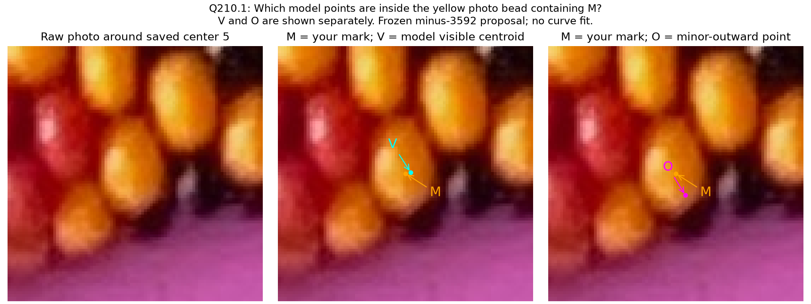
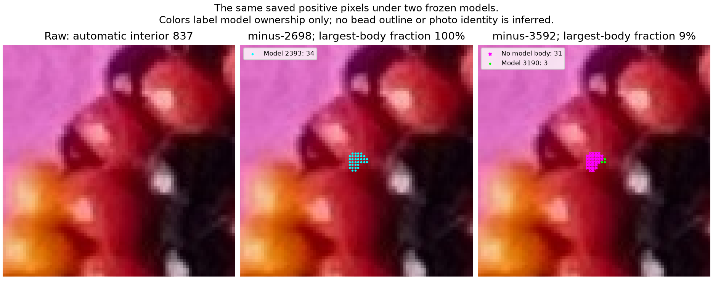
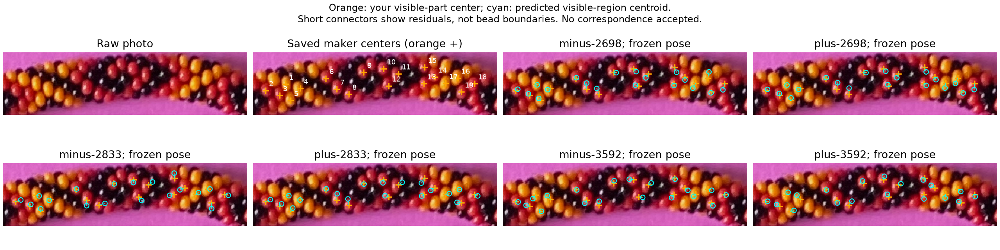
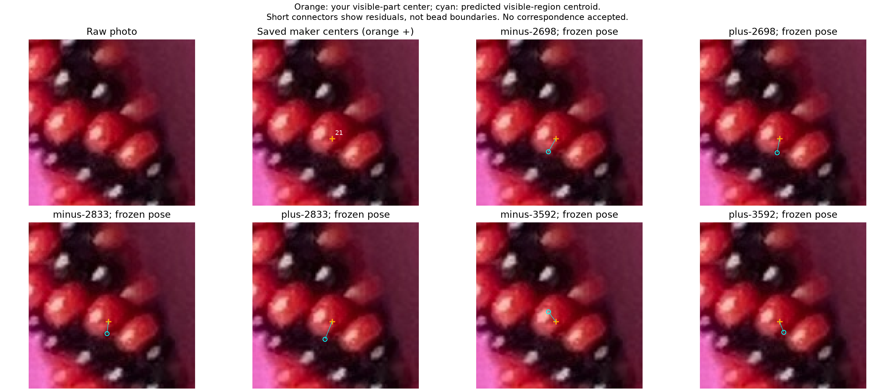
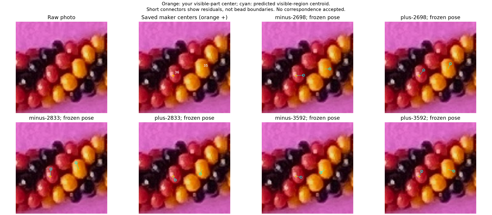
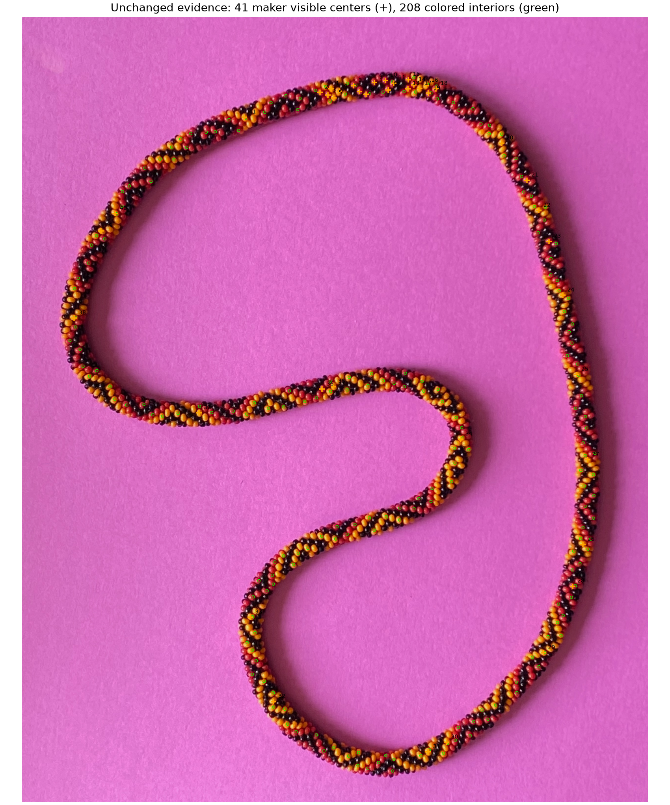

# Visible-region correspondence pilot — R210–R213

The first comparison uses all **41 saved visible-part centers** and **208 colored
interior references** against six frozen models. There is a useful disagreement:
3,592 beads gives the smallest center distances, whereas 2,698 gives the most
coherent predicted ownership of the saved interior patches. A center-distance
minimum alone cannot choose the bead count. Neither helicity is established.

## Q210.1 — Two different geometric points on one proposed bead



**Which model points lie inside the yellow photo bead containing M: V and O,
V only, O only, neither, or cannot tell?** M is your saved **center-mark 5**,
not automatic observation 5 or a full-string bead index. The middle panel shows
V, the predicted visible-region centroid. The right shows O, the minor-outward
point used for the earlier cyan circles. Separate panels avoid overlapping labels.

This is a tentative association in the fixed minus-3,592 model. V is 1.89px
from M; V and O differ by 8.16px. An answer would confirm only the pictured
point/body memberships, not exact centers, safe-region extent, adjacency, the
model's count/hand or a string index. [Exact points and source hashes](correspondence-question-r210.json).
**R211 answer: “V M and O are all in the same bead.”** All three pictured
point locations now belong to the same photo bead containing your center-mark5.
This does not confirm their exact geometric meanings or the model's index/count.
[Exact reply and criticism](correspondence-answer-r211.json) ·
[Bounded point facts](review/r211/confirmed-point-facts.json).
No questions remain pending. The original image and question coordinates are
preserved; the issued question file retains its original status as a frozen record.

You also questioned whether the darkness method works reliably or is trusted.
V and O were calculated from model geometry; photo brightness did not place them
or cause this question. Appearance measurements supplied the earlier small
positive patches and diagnostic transition candidates. Those cues were never
validated as complete photo boundaries or distances to a bead edge.

**R212 clarifies the objective: a useful patch of pixels definitely inside each
selected bead is sufficient.** Separating a dark bead edge from a dark gap is
not a prerequisite. Use the saved positive patches for matching; uncertainty
about surrounding borders does not invalidate a well-supported interior.
[Exact scope correction](positive-patch-scope-r212.json).
No automatic bead-region expansion or new edge/gap classifier is introduced.

**R213 prioritizes easier nearby evidence.** When a body is visually difficult,
look along the necklace for adjacent clear colored interiors and use them to
establish locations. Difficult bodies stay unresolved in coverage accounting;
they do not hold up matching supported observations. Further questions should
favor easy, informative examples needed for coverage, rather than settling every
ambiguous patch. The goal is broad coverage of usable visible bodies; the sparse
208 references alone do not establish a majority of all visible beads.
[Exact priority instruction](easy-evidence-priority-r213.json).

## Methods and measurement meanings

Four comparisons were considered: nearest exposed minor-outward points, nearest
projected physical centers, nearest **visible-region centroids**, and exact
first-hit membership of positive interior pixels. The latter two supply the
pilot's main measurements; the former two remain explicit comparisons.

The centerline, orthographic view and historical hand-specific phase/origin
remain fixed. Counts 2,698 and 2,833 reproduce the original and approximately
+5% hypotheses. Count 3,592 comes from the previous fixed-parameter center-score
minimum; it is a diagnostic hypothesis, not a known bead count. Elevation 89°
is the old camera/phase gauge, not a measured camera elevation. Count changes
projected bead scale because the literal placement model ties circumference
to row count. No curve, camera, phase, origin or local stretch is fitted here.

For each model, keep **every bead as an occluder**, including hidden bodies.
Candidate bodies have projected physical centers within three conservative
bead bounding radii of a maker center. Rasterize the union of their **complete
projected bounds** on a global native 2px grid; do not clip a bead to a window
centered on its observation. Every ray uses the same exact annular-surface
first-hit kernel as the previous independently checked model.

For each candidate, the area mean of verified pixels owned by that bead is
its visible-region centroid. This mean can lie in a hole or outside a crescent;
it is not required to be a surface point. It is a geometric proxy for the
center of the visible part that you picked, with unspecified marking uncertainty.
It is distinct from the physical center, reflection position and minor-outward
anchor. No intensity weighting or photo highlights enter this predicted mean.

Unfinished ray pairs remain unresolved. Exclude their pixels from the known
visible region and retain, per body, an upper bound on movement of the finite-grid
mean if unresolved samples in its complete conservative bound were added.
This is numerical uncertainty, not a bound on continuous raster error or on
your marking error. Dropping every body whose bound contains an unresolved
ray was an overly strict initial probe: it removed nearby candidates and made
the nearest search misleadingly distant. The final pilot retains the numerical
uncertainty explicitly rather than treating those estimates as exact.

For central fitting, candidate outward anchors must separately pass the existing
exposure test and facing margin 0.12; at least 48px² of sampled visible area
(12 verified samples at 2px spacing) is required at either raster resolution.
Compare a maker center to the nearest eligible predicted visible
centroid within three conservative radii. Save the second choice and distance
gap. Associations are independent: duplicates are reported rather than forced
apart. Missing matches cannot improve the score. All final visible-centroid
cases have 41 proposals and no duplicated nearest owners; 6–11 alternatives
are within 2px in distance, so proximity does not resolve all identities.

For each selected colored interior, trace **every saved integer pixel** in its
small positive patch. Record all predicted owners, background and unresolved
rays. A coherent central patch has at least 95% of its pixels assigned to one
body, no unfinished rays, and that body's outward anchor exposed. This is a
conditional compatibility test, not new confirmed photo ownership. No demand
is made that the cyan outward point lie inside the tiny observed patch.
Colored references enter matching; model bodies have no recovered color sequence.

## Six frozen hypotheses

RMS is over all 41 center distances. Balanced RMS gives equal weight to each of
the eight occupied approximate image-arclength sectors, preventing the dense
top cluster from dominating. Coherent patches use the separate membership
definition above; the denominator is always 208.

| Frozen model | Center RMS (px) | Balanced RMS (px) | Coherent central patches / 208 |
| --- | ---: | ---: | ---: |
| Minus 2,698 | 10.11 | 11.31 | 111 |
| Plus 2,698 | 10.25 | 11.64 | 120 |
| Minus 2,833 | 10.83 | 11.42 | 97 |
| Plus 2,833 | 9.30 | 9.33 | 93 |
| Minus 3,592 | 7.38 | 7.04 | 61 |
| Plus 3,592 | 8.00 | 7.50 | 65 |

The 3,592 models use smaller projected beads, so close nearest-center proposals
can coexist with interior pixels crossing predicted seams, holes or gaps.
Phase/origin have not been optimized against this evidence. These conditional
scores do not recover N, select a hand or certify the centerline.
41–48 patches per model include unresolved numerical rays; this count can overlap
the split/background category and must not be added as a separate partition.
No different appearance modes share a coherent predicted owner in this sparse
subset; that absence of contradictions does not validate the poses.



This example is chosen to show the largest coherence difference between the
minus-2,698 and minus-3,592 models among resolved pixels. The raw photograph
comes first. Colored dots label **model owners**, and magenta crosses mean no
model bead was hit. They do not classify the photo pixels as background or
move the existing safe interior. No whole-bead boundary is drawn.
[All sampled pixels and predicted owners](review/r210/membership-contrast.json).

## Raw context and proposed center matches

Orange crosses are your saved centers. Cyan small rings are predicted visible
centroids, with short residual connectors. They are **not** the old minor-outward
tangent circles or bead-boundary lines. Each crop has raw context first, your
marks second, then all six frozen hypotheses.









## Known geometry and numerical checks

Two existing independent POV-Ray ID renders, one for each hand at N=2,698,
provide eight spatially spread visible-region centers each. The current model
recovers **all 16 expected nearest associations**. Its 2px-grid centroids differ
from full rendered-mask means by at most **0.51 native pixels**; the outward
points differ from those same visible centers by up to **10.59px**.
On 4,761 verified rays across complete bounds, Python and POV-Ray ownership
agree exactly. Another 28 rays remain explicitly unverified. These are forward
geometry/association checks with evaluator-provided synthetic centers, not an
image-only inverse test or photo-identity proof.
[Known checks and fixture hashes](review/r210/calibration.json).

For minus-3,592, refining the native raster from 2px to 1px changes the 41
selected predicted centroids by at most **0.47px**, changes no nearest index,
and changes balanced RMS from 7.043 to 7.049px. This small difference cannot
explain the conflicting count preferences. [Resolution comparison](review/r210/resolution.json).

Four adverse controls cover visible-center/outward semantics, preserved duplicate
observations, missing/hidden candidates, all-pixel ownership with unfinished
rays, and same-owner appearance conflicts. Original 41/208 positions, IDs,
source geometry, live centers, score files and annotation saves remain unchanged.

```bash
.venv/bin/python photo2/review_visible_correspondence.py
.venv/bin/python -m unittest discover -s photo2 -p test_visible_correspondence.py
```

[All six correspondence proposals, scores and patch memberships](review/r210/report.json)
· [Measurement implementation](visible_correspondence.py)
· [Source/output/protected-input hashes](review/r210/summary.json).
Existing known-render files are used from `photo2/output/r179`; their exact hashes
and original report/configuration hashes are recorded. No new POV render is made.

Q210.1 is answered; stop this answer/scope-recording step here.
Next bounded task: test limited phase/origin registration
using both center residuals and positive patch membership, with held-out sections,
before moving the centerline. A useful positive interior is sufficient; do not
add an exact edge/gap distinction or full-boundary requirement.
If more localization is needed, use nearby easier colored evidence and retain
difficult cases as unresolved.
Preserve both hands/count alternatives and the
user's eventual small zero-net stretch constraint. Recommendation:
gpt-6.1-sol / High; same session, no `/new`.

Record the answer reproducibly with:

```bash
.venv/bin/python photo2/record_correspondence_answer.py
.venv/bin/python -m unittest discover -s photo2 -p test_correspondence_answer.py
```
