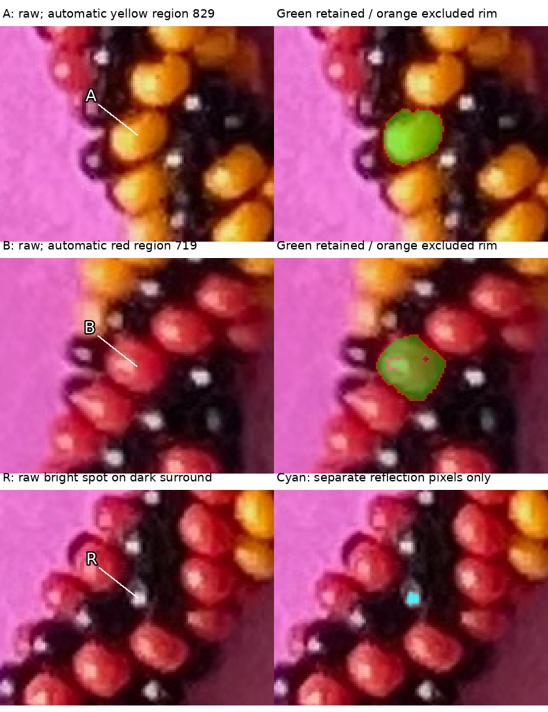
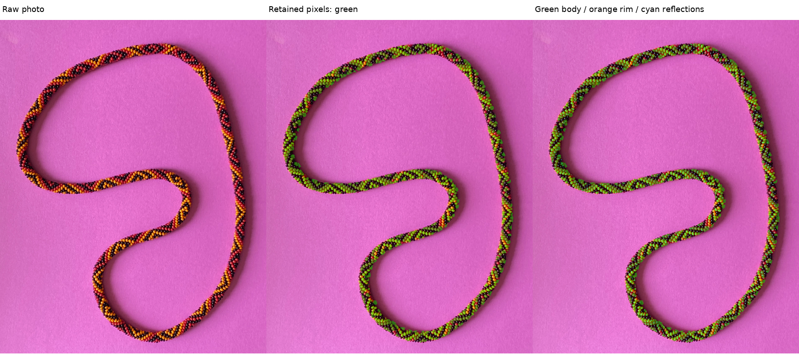
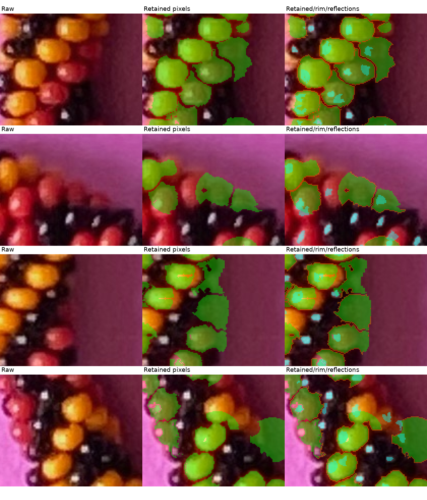

# Visible colored pixels and separate reflections — R215

The active goal is **70–90% of the actual visible pixels of red and yellow
beads**, with darker regions guiding boundaries and their nearby bands, and
specular reflections recorded separately. This replaces the tiny-patch-only
goal and postpones the planned centerline correction. **Manual bead marks,
their adjacency series and simulated photo positions are not inputs.**

The new program produces broad regions throughout the photograph. Four known
render examples retain **69.87–74.17% of all visible colored pixels**, with no
retained paper or black-body pixels in those examples. The median coverage per
eligible colored bead is **78.1–79.8%**. Some bodies remain under-covered, split
or merged. These are useful pixel measurements, not a certified complete photo
inventory. Actual photo coverage still needs review; it is not measured by a
fraction of the detector's own proposed region.

## Q215.1 — Broad visible regions

In the first two rows below, do the green regions A and B capture roughly
70–90% of their yellow/red beads' visible parts while staying inside their beads?
A/B identify new automatically selected regions, not your previous bead numbers.
Green is retained; orange is the excluded part near the proposed region's rim.

## Q215.2 — Reflection pixels

In the last row, does cyan R mark the specular reflection itself, keeping the
surrounding dark bead out of cyan? No black bead outline or center is proposed.



Both questions are answered. **R216 / Q215.1:** “Yes, roughly 70–90% and inside”.
**R217 / Q215.2:** “Yes”. [Exact replies](segmentation-answers-r216-r217.json)
and [confirmed pixel facts](review/r215/confirmed-pixel-facts.json) bind these
answers to the unchanged [coordinates, masks and crops](review/r215/review-locations.json)
and [as-issued question/image manifest](segmentation-questions-r215.json).
The manifest preserves the original pending state; the separate answer record
is the current status. These confirmations apply to illustrated yellow A
(region829), red B (region719) and reflection R (spot28). They do not certify
every bead, exact centers, full silhouettes, string indices or adjacency.

## Whole-photo coverage and wider context





Full-resolution files for zooming are
[body pixels](output/r215/body-overlay.png) and
[body/rim/reflection layers](output/r215/body-band-reflections.png).
Green, orange and cyan are display colors, not appearance classifiers.
Unpainted areas remain unresolved or excluded, not automatically background.
Orange is a band near a **proposed** colored region; it does not label all dark
gaps or surrounding black bodies as boundaries.

## Method and interpretation

Four methods were compared before implementing this phase:

| Method | Strength | Limitation |
|---|---|---|
| Hue/saturation region growth | Good colored cores | Similar hues and shadowed paper can overlap |
| Distance watershed within color masks | Simple separation at narrow parts | Narrow parts can belong to one bead |
| Automatic cores and dark-valley watershed | Local darkness and color guide growth | Body ownership and ambiguous dark areas still require checks |
| Local contours around bright interiors | Flexible outlines | More tuning and contour freedom before broad coverage is checked |

The main method is the third, with a color-distance comparator preserved in
[the comparison report](review/r215/comparison.json). Both use the same learned
palette, search domain, seed/radius guards, reflection extraction and retention
preference. The main method adds a dark-valley elevation and seed-relative
diffuse floor. This is a prototype segmentation experiment, not a fitted model.

Paper appearance, chromatic families and an apparent bead scale are estimated
from each input. The paper initialization uses the supplied generic framing
prior. Saturation/chromaticity distinguish colors that share paper hue; neither
magenta nor saved HSV rectangles define background. Pixel extraction no longer
depends on tracing a closed centerline or an adjacency graph. A medial-distance
statistic estimates scale; no physical spline is fitted or loaded.

Automatic coarse color cores plus native-scale supported cores seed a watershed.
Local diffuse brightness relative to its neighborhood defines dark valleys;
hue changes also contribute. Compact detected highlights are median-replaced
only in this boundary cost, so a white reflection does not become a boundary
marker. Raw image pixels and the separate reflection layer are preserved.

Candidate regions stop at a relative diffuse floor, a scale-derived radius and
connected support. Their weakest rim pixels are omitted using interior distance,
diffuse brightness and valley evidence. The 90% candidate-retention preference
resolves integer-distance ties; it is **not** a claim of 90% true coverage.
Multiple retained components remain explicit. Unknown domain pixels, excluded
seeds, slivers, missing IDs and possible mixed-body regions are not promoted
into trusted bead identities.

Reflection candidates require compact local brightness excess with a saturation
drop or a neutral highlight on a dark surround. Each has explicit native pixel
runs, a weighted position and threshold-position sensitivity. Positions are not
bead centers or outward anchors. Association with a colored candidate region is
tentative. Unassociated spots remain separate; no full black extent is inferred.
Body pixels may overlap reflection pixels because a reflection lies on the body.
The `diffuse_retained` layer removes those pixels for later appearance work.

## Measured checks and limits

All image-only extraction finishes before rendered owner IDs are read. Pixel
recall includes missed and partially hidden colored bodies in its denominator;
the eligible-body table separately uses the older declared area threshold.

| Render example | Colored pixel recall | Retained color precision | Median eligible-body coverage | Eligible bodies in 70–90% |
|---|---:|---:|---:|---:|
| + hand, blue/amber/black | 71.87% | 100% | 78.74% | 79 / 112 |
| − hand, same palette | 69.87% | 100% | 78.11% | 81 / 113 |
| + hand, changed palette/background/placement | 74.17% | 100% | 79.55% | 88 / 113 |
| + hand, changed framing with beads at the border | 73.52% | 100% | 79.82% | 85 / 112 |

Purity of individual region ownership is weaker than color precision: some
regions contain pixels from more than one colored bead. The final examples have
90/107, 87/105, 97/114 and 97/111 regions with at least 98% one-body purity.
Pixel coverage therefore does not establish one region per bead. The examples
were used during development; the fourth initially withheld case exposed a
framing failure and is now a regression example, not independent holdout.
[Full body/region witnesses and input hashes](review/r215/calibration.json).

A separate controlled render turns off only `phong 1.4` in three materials.
The detector finds 71 reflection candidates in the shiny image and zero in its
diffuse-only counterpart. **68/71 candidate centroids** show an added RGB channel
greater than .04; **77.1% of proposed reflection pixels** pass that stronger
specular-difference threshold. This leaves uncertain tails/candidates. Encoded
pixel differences here support specular origin in this one scene; they do not
prove physical reflection masks throughout the photo. Saturated diffuse blobs
are rejected and compact neutral highlights are localized in two adverse unit
controls. [Controlled render, command and measurements](review/r215/specular-control.json).

Earlier failures are kept separate in [the development audit](review/r215/adverse-controls.json):
hue-only background preference suppressed amber on brown paper; a uniform
one-pixel inset lost too much of small faces; unrefined dark candidate extents
were too broad; closed-axis tracing was an unnecessary dependency; contaminated
border tails initially rejected almost the entire extra framing example.
No generality or guaranteed minimum coverage is claimed from these four renders.

## Files, reproduction and stopping point

The native photograph currently has **683 proposed broad regions, 422,487
retained pixels, 47,121 excluded rim pixels and 1,339 reflection candidates**.
724 reflection candidates associate with a proposed colored region; remaining
spots have no confirmed body ownership. The 683 are region proposals, not a
verified bead count. [All records and parameters](review/r215/regions.json).

The program writes integer candidate/body/diffuse/reflection label TIFFs, a
boundary-band PNG, the full mask archive and JSON records under `photo2/output/r215`.
Those routine outputs stay ignored; the review images and evidence ledgers are
tracked. [Source/output hashes and protected inputs](review/r215/summary.json).
[Verification](review/r215/verification.json) confirms 17 curated payloads and
the native mask archive repeat byte-identically, and checks layer/export
consistency, answer bindings and preserved historical evidence. Eight source
POV scenes in [the fixture directory](review/r215/fixtures) preserve the known
appearance/owner controls; existing renders under `output/r167` are reused.
Saved manual labels/adjacency, center marks, scores, original photo, POV source,
historical evidence and registration configurations remain unchanged.

```sh
.venv/bin/python photo2/segment_colored_beads.py
.venv/bin/python photo2/check_colored_segmentation.py --extra-fixture hand+1-palette1-shift3
.venv/bin/python photo2/check_specular_pixels.py
.venv/bin/python photo2/review_colored_segmentation.py
.venv/bin/python -m unittest discover -s photo2 -p test_colored_segmentation.py
```

Stop at this broad-pixel/reflection review; both visual answers are preserved.
Next improve remaining low-coverage or mixed regions using nearby easy
color/dark-boundary evidence. Establish this pixel basis before position fitting,
centerline correction or adjacency work. Recommend **gpt-6.1-sol / High**, same
conversation; no `/new` needed. The user controls model/session changes.
