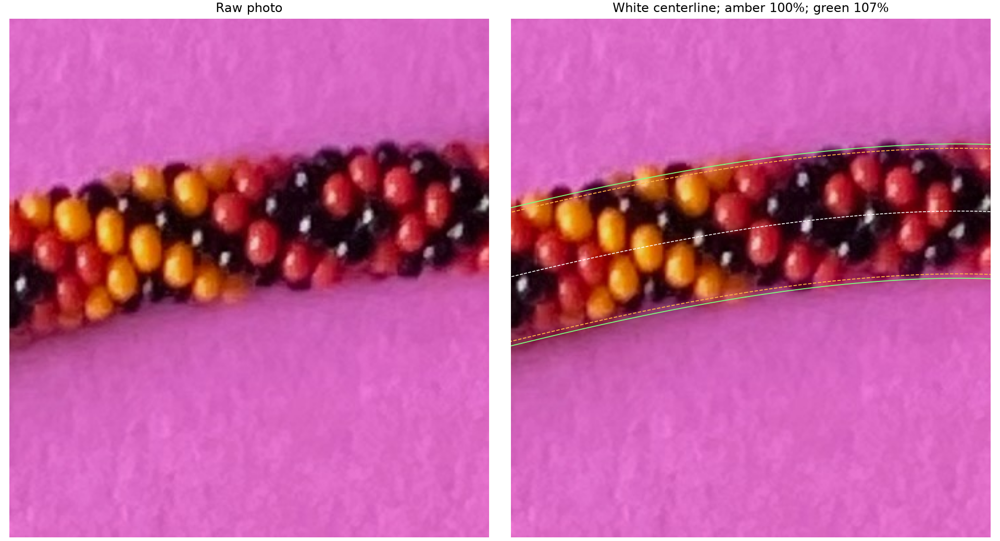

# Centerline ± maximum radius; +7% comparison — R183

The viewer now marks the requested smooth width band around the centerline.
Restart a running Python viewer (Ctrl+C), run it again, and reload its page:

```bash
.venv/bin/python photo2/tangent_viewer.py
```

White dashed is the centerline. Amber dashed marks **centerline ± current
maximum radius**. Green marks the comparison width, initially **107%** of
the current model. The Guide width control adjusts it from80% to130%; Model
width and +7% buttons restore100% and107%. Edges and Centerline checkboxes
toggle the guides. Zoom/pan and the bead-count control work as before.

The green comparison changes only the guides. **Cyan circles and physical bead
placement remain fixed.** Both sides move out by7% of the radius, increasing
the full diameter by7%. Save choice retains width/visibility settings, and
PNG exports include the selected guides. Existing saved choices remain readable;
if they contain no guide settings, the initial comparison is107%.



[Whole-photo guide overlay](review/r183/whole-guides.png),
[exact dimensions, parameters and hashes](review/r183/summary.json),
[viewer instructions](TANGENT_VIEWER.md).

## Definition and limits

Three methods were considered: smooth image-normal centerline offsets, a
projected3D envelope, and traced discrete bead silhouettes. The first implements
the requested reference band with explicit uncertainty and leaves silhouette
recovery for a later step. Under the current orthographic projection, its
normal support agrees with a circular cross-section of the modeled radius.

The maximum minor radius is **rho = chain_minor + bead_radius = 6.110915749**
model units, including the outer bead wall. Let c be the projected centerline,
n the image unit normal perpendicular to its projected tangent, and s the
model-to-image scale. The two guides are **c ± rho·s·n**. The comparison is
**c ± factor·rho·s·n**, where factor initially1.07. The source curve is sampled
at2048 equal world-arclength intervals and closed at its starting point.

These curves are **model references**, not detected photo edges or verified
anchors. Actual visible bead scallops, gaps, axial curvature effects and cast
shadow need separate interpretation. The historical centerline may itself
be displaced. Smoothness does not establish an observed boundary. No outline
is adopted into the automatic detector or propagated as a verified photo mask.

The maker says the actual visible diameter may be about7% larger. This is a
proposal for comparison, not a confirmed measurement or a change to bead size.
The curated example uses2698,hand−1; live guides follow the selected count:

| Count | Current diameter (source pixels) | 107% comparison |
| ---: | ---: | ---: |
| 2,698 | 94.402 | 101.010 |
| 2,833 | 89.855 | 96.145 |

Increasing count on the unchanged image spline shrinks the current model's
projected width; therefore the width percentage always refers to that selected
count. Both helicities use the same width geometry and their existing local
registrations. No helicity or bead-count inference follows from these guides.

**Q183.1:** In the raw/guide comparison, do the green107% lines bracket the
visible bead bodies better than amber100%, ignoring cast shadow and small
scallops? **Answered R184:** “green is closer, but still too small.” The maker
also says the centerline is good but imperfect. This is qualitative evidence;
no additional percentage or corrected curve was supplied. [Preserved answer](width-feedback-r184.json).
The next request is [center marking and a count-error graph](CENTER_MARKS.md).

## Validation and stopping point

Seven Python checks pass, including the old four-variant circle/exposure
comparisons, exact circle projection, closed/unit-normal guide geometry,
normal support at65°/89° camera elevations, count-dependent scale with unchanged
centerline, saved settings/backups and old-choice compatibility. Five JS checks
pass, including symmetrical107% offsets and alignment through zoom/pan.
Browser/server/launcher interaction remains untested. Old comparison images,
source photo, beads.pov, geometry kernel and live maker files are preserved.

```bash
.venv/bin/python -m unittest discover -s photo2 -p test_tangent_viewer.py
node photo2/tangent_viewer/viewport.test.mjs
.venv/bin/python photo2/review_width_guides.py
```

Stopping point: requested width guides and adjustable +7% comparison, with
raw context and saved settings. Next bounded task: use the width review or
saved choice to decide whether width or centerline needs refinement before
interpreting count drift. Recommend **gpt-6.1-sol / High**, same session;
no `/new` needed.
